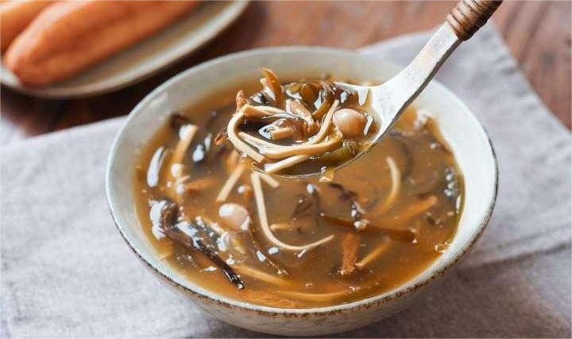
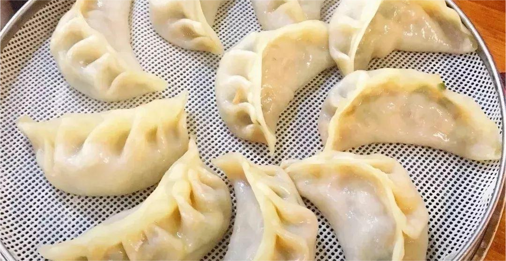

# 欢迎进入河南美食

> 这是一个分享河南美食的Wiki网站

___

    

        
        
<a href="http://localhost:63342/docs/index.html?_ijt=cos7a9r8nu16tmqu82m5jhejq5#/laravel/base/1.%20%E6%B2%B3%E5%8D%97%E7%83%A9%E9%9D%A2">河南烩面</a> 一道河南回忆美食

    

    

         
        
胡辣汤 一道河南回忆美食

    

    

        
        
灌汤包 一道河南回忆美食

    

    

         
        
濮阳壮馍 一道河南回忆美食

    

         
        
烫面角 一道河南回忆美食

    

    

        
        
酸浆面条 一道河南回忆美食

    

    

         
        
怀府闹汤驴肉 一道河南回忆美食

    

    

        
        
鸡蛋灌饼 一道河南回忆美食

    

    

         
        
安阳血糕 一道河南回忆美食

    

    

         
        
饸饹面 一道河南回忆美食

    

 
 
 
 
 
 
 
 
 
 
 
 
 
 
 
 
 
 
 
 
 
 
 
 
 
 
 