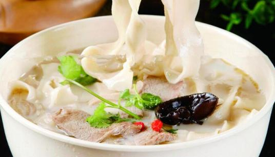

    河南烩面

 

<table style="border:none;">
    <tr>
        <th colspan="5"style="border:none;width: 850px">
            目录
        </th>
    </tr>
    <tr style="width: 500px; border:none;">
        <td style="border:none">
        美食历史
        </td>
        <td style="border:none">
        传说典故
        </td>
        <td style="border:none">
        食材做法
        </td>
        <td style="border:none">
        视频解析
        </td>
        <td style="border:none">
        音频解析
        </td>
        <td style="border:none">
        地图导览
        </td>
    </tr>
</table>

|  [美食历史](#美食历史)   |  [必备良药](#必备良药)  |  [食疗进补](#食疗进补)  |  [食材做法](#食材做法)  |
|:----------------:|:---------------:|:---------------:|:---------------:|

## 美食历史

___

>郑州烩面，诞生于中国河南省的一种主食。
烩面以优质高筋面粉为原料，辅以[高汤](/laravel/base/materials/高汤.md)及多种配菜，汤用上等嫩羊肉、羊骨（劈开，露出中间的骨髓）一起煮五个小时以上，先用大火猛滚再用小火煲，其中下七八味中药，
以把骨头油熬出来为佳，煲出来的汤白白亮亮，犹如牛乳一样，所以又有人叫白汤。辅料以[海带丝](/laravel/base/materials/海带丝.md)、[千张丝](/laravel/base/materials/千张丝.md)
、粉条、香菜、鹌鹑蛋等，上桌时再外带香菜、辣椒油、糖蒜、 辣椒碎等小碟，分为汤面和捞面两种[[1](https://baike.baidu.com/item/%E6%B2%B3%E5%8D%97%E7%83%A9%E9%9D%A2/3235660)]。

>河南省饮食文化研究学者、河南省非物质文化遗产专家委员会委员张海林解释，烩面是古时哺饦（bū tuō）技法的演变和再现。贾思勰曾在《齐民要术》中详记了哺饦的
技法：“哺饦，捋如大指许，二寸一断，著水盆中浸，宜以手向盆旁捋使极薄，皆急火逐沸熟煮。”就是将和成之面，以二寸为段，用手捋薄，擘开煮而食之。这种做法，
和烩面一脉相承，只是那时称煮，今日说烩，而烩不过是煮法之一，是以旺火和相对较长的时间使原料入味，汤汁浓厚的一种烹饪方法。
从明代到民国，在很长一段时间内，刀切面、刀削面是民间、馆业面食的主要制法，抻面、拉面成为特殊工艺，哺饦之法更是很少有人采用。以致很多人把烩面这个哺饦的
演变和再现认为是烩馍的演变，更有人认为是自己饭店的自创，这其实是历史造成的误会。
在1956年之前，郑州乃至河南省内，还没有一家主营羊肉烩面的面馆或者摊位，很多老郑州人并不知道郑州有烩面这么个面食品种。1956年公私合营后，郑州市饮食公司
成立合记烩面馆，成为省内首家以羊肉烩面为专营品种的面馆。相对于传统中餐，烩面这种新型饮食品种方便、快捷，故迅速颠覆了之前河南人吃面的习惯。再加上郑州便
利的交通条件，南来北往的旅客多，烩面这种颇具地方特色的饮食便成为旅客首选。改革开放后，随着萧记、裕丰源、汇丰源、巴老三、76人等烩面馆的加入、扩张，使得
烩面迅速成为郑州的全民食品，成为郑州乃至河南的饮食代表。

## 传说典故

>**唐太宗落难说** 
传说李世民登基前，隆冬落难逃亡途中染病，幸得一农家收留。农家淳朴，宰家养麋鹿炖汤，又迫于追兵草草将和好的面拉扯下锅。李世民吃下，寒疾痊愈。即位后，李世
民派人寻访，命御厨学艺，唐宫御膳就多了道“麒麟面”。后因麋鹿稀有就用山羊替代，逐渐演变成烩面。

> **豫籍京官厨子自创说** 
光绪年间，长葛厨师郭子兴在京开一面馆。因为常有敲诈勒索之事发生，便找同乡杨翰林帮忙。杨翰林就是杨佩璋，长葛人，后官至都察院副都御史。杨翰林为了保护郭子
，就把郭子兴聘到府上做厨子。辛亥革命后，杨翰林偕郭子兴告老还乡。秋日偶遇风寒，郭子兴便试着用大骨头、肉茸加一些入味的中草药炖汤后煮面给杨翰林吃，没想到
深得杨翰林赞许，并从此成为杨家的日常饮食。民国九年，杨翰林在长葛老家去世，临终前送郭子兴银两，让他再行开店，且叮嘱郭子兴不要将烩面失传。不料，长葛当时
寇匪猖獗，官兵不能剿办，时局不安，再无开店机会。郭子兴有一远房亲戚，于黄河岸边花园口附近，为了生存，只好投奔那里。烩面就是郭子兴此时传到郑州的。

>**日机轰炸郑州说**
烩面是由长垣籍厨师赵荣光创制的。赵荣光喜面食，尤其对面条特别钟爱。抗日战争时期，郑州的饭店经常因躲避空袭关门，有时厨师们刚端起饭碗就要急于逃命。当时粮
食紧缺，赵师傅不忍将剩饭弃掉，空袭结束后，就把剩饭加汤烩烩再吃。久而久之，赵荣光发现重新烩过的面很好吃，就在面里放些盐、碱之类的原料，使面更筋，别有一
番风味，成为店员的一个主要伙食品种。后来，一些老顾客无意中发现店员吃的这种面很有特色，就要求饭店售卖。赵荣光由此开始精心配制烩面。他选用上好的鲜羊肉，
放入各种原料将肉煮烂，面条下锅时用原汁肉汤，再放入羊肉、黄花菜、木耳等，味道十分鲜美，于是，烩面便逐渐成为该店的热卖品种。

## 食材做法

<table>
    <tr>
        <th colspan="8" align="center">食材</th>
    </tr>
    <tr>
        <td>面粉500g</td>
        <td>水大半碗</td>
        <td>盐5g</td>
        <td>羊肉400g</td>
        <td>海带丝</td>
        <td>豆腐干</td>
        <td>粉丝</td>
        <td>调料</td>
    </tr>
</table>

#### **食材原料**
>**1.熬羊肉汤** 
食材：羊肉3000克、羊骨架6000克、羊油750克、生姜100克、大葱250克、花椒10克、八角15克、三柰5克、桂皮5克、小茴5克、草果5克、良姜5克、丁香2克、精盐料酒各适量。

>**2.制作面坯** 
食材：高筋面粉10千克、精盐200克、色拉油适量。

>**3.调配料** 
食材：熟羊肉1500克、豆腐皮600克、水发粉丝600克、水发黄花600克、水发木耳600克、香菜300克、当归、枸杞各30克、精盐、鸡精、味精、鲜味王、香油、羊油、糖蒜、油炸辣椒各适量。

<table>
    <tr>
        <th>工序</th>
        <th>步骤</th>
        <th>操作</th>
    </tr>
    <tr>
        <td rowspan="2">熬羊肉汤</td>
        <td>步骤一</td>
        <td>羊肉切成大块，同羊骨架一起用清水洗净，再放入清水中浸泡约1小时后捞出； 羊油洗净切成丁；生姜拍破；大葱挽结；将花椒、八角、三柰、桂皮、小茴、草果、良姜、丁香用纱布包住，制成香料包。</td>
    </tr>
    <tr>
        <td>步骤二</td>
        <td>将羊骨架放不锈钢桶中，掺入清水约60千克，用大火烧沸后，撇净浮沫，再放入羊油丁、生姜、大葱，倒入料酒，用中火煮约2小时后，放入香料包（用羊骨架压住），续煮约1小时至香味溢出时，放入羊肉块，改用小火煮约5小时，至羊肉软时，调入精 盐，将羊肉捞出晾凉，另将汤面上的浮油撇净（留用），即成羊肉汤（此时桶中汤汁约剩45千克）。熬羊肉汤时亦可在汤中加入鸡骨架，以增加汤的鲜味。</td>
    </tr>
    <tr>
        <td rowspan="2">制作面胚</td>
        <td>步骤一</td>
        <td>将面粉与精盐和匀，再加入清水约4千克，揉成稍硬的面团后，盖上湿纱布饧约10分钟。将面团反复揉搓，然后再给面团盖上湿纱布饧约10分钟。揭开纱布，再揉搓至面团表面光滑，接着将面团搓成直径约6厘米的长条，然后下成每个重125克（湿重）的剂子。</td>
    </tr>
    <tr>
        <td>步骤二</td>
        <td>将每个面剂搓成长15厘米、直径约3厘米的圆条，盖上湿纱布饧约5分钟后，再用擀面杖擀成15厘米长、8厘米宽、1．5厘米厚的长方形面片，并在面片上均匀地抹少许色拉油，即成烩面面坯，将其整齐地摆入托盘内，用保鲜膜盖严，约20分钟后即可进行抻拉。夏季可在面团中加入少许食用碱。这样既可防止面团变酸，又可增加面团的筋力。</td>
    </tr>
    <tr>
        <td rowspan="2">调配料</td>
        <td>步骤一</td>
        <td>熟羊肉切成丁；豆腐皮洗净切成丝；水发粉丝切长节；水发黄花撕成细丝；水发木耳撕成小块；香菜洗净切节；当归、枸杞用清水浸泡10分钟；糖蒜、油炸辣椒分别装入小碟内。</td>
    </tr>
    <tr>
        <td>步骤二</td>
        <td>将羊肉丁、豆皮丝、粉丝、黄花、木耳分成50份；将当归、枸杞入锅加清水熬出味后，分别舀入50个大碗内，再分别往碗中放少许精盐、鸡精、味精、鲜味王及羊油。</td>
    </tr>
    <tr>
        <td rowspan="2">拉面煮面</td>
        <td>步骤一</td>
        <td>取一块烩面面坯（面片），两只手掌向上托住面片的两头，再用两手的拇指按住面片两头的边缘，然后两只手掌左右抻拉（手臂基本不用力），将面片拉成长约1米的片，接着两只手掌上下晃动，手臂均匀用力，将面片继续抻拉成约3米长、8厘米宽、0.1厘米厚的面片，最后用左手夹住面片的两头，用右手的拇指、食指、中指配合，将面片横着撕成约3厘米宽的面条，即可下锅煮制。</td>
    </tr>
    <tr>
        <td>步骤二</td>
        <td>小锅上火，注入羊肉汤1250克，烧开后即下入拉好的面条，并用手勺将面条轻轻拨散，使之受热均匀，待锅中汤汁再开后，下入一份配料（羊肉丁、豆皮丝、粉丝、黄花、木耳），煮至面条、配料均熟后，起锅装入放有调料的碗中，再舀入锅中汤汁，淋少许香油，撒上香菜，随糖蒜、油炸辣椒碟上桌，即成。</td>
    </tr>
</table>

## 视频解析

<video>
    <source src="/video/Braised noodles making video.mp4"></source>
</video>

## 音频解析

<iframe frameborder="no" border="0" marginwidth="0" marginheight="0" width=330 height=86 src="//music.163.com/outchain/player?type=2&id=1899226663&auto=1&height=66"></iframe>

## 地图导览

[地图](https://www.google.com/maps/search/%E6%B2%B3%E5%8D%97%E7%83%A9%E9%9D%A2/@34.553809,112.085467,7z/data=!3m1!4b1)

 

