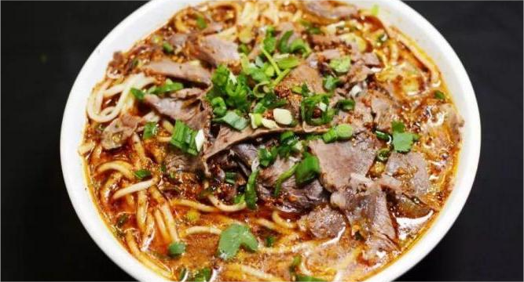

    饸饹面

 

>---河南平顶山

<table style="border:none;">
    <tr>
        <th colspan="8"style="border:none;width: 850px">
            目录
        </th>
    </tr>
    <tr style="width: 500px; border:none;">
        <td style="border:none">
        美食历史
        </td>
        <td style="border:none">
        传说典故
        </td>
        <td style="border:none">
        食材做法
        </td>
        <td style="border:none">
        视频解析
        </td>
        <td style="border:none">
        音频解析
        </td>
        <td style="border:none">
        地图导览
        </td>
        <td style="border:none">
        营养价值
        </td>
        <td style="border:none">
        各地对比
        </td>
    </tr>
</table>

## 美食历史

---

>饸饹面（市面上又称合罗面）是一种中国北方晋冀鲁豫陕甘六省的传统特色面食之一，制作者先将饸饹床子架在锅的正上方。将和好的荞麦面、高粱面（现多用小麦面）放
在饸饹床子（包含放面的漏孔）里，并坐在杠杆上直接把面挤轧成长条（面条状）煮入锅中。这种传统独特的饮食制作方式，不知从何时一直延续，成为中国西、北方地区
独特的风味名吃。尤以山西南部饸饹面起源早，在运城、临汾、晋城地区大街小巷随处可见饸饹面馆，当地人开玩笑说“曲沃饸饹面”可以申请非物质文化遗产，可见当地人
们喜爱饸饹程度。

>河北无极县西关饸饹锅、河南郏县饸饹面、内蒙古乌兰察布市荞面饸饹也是远近闻名，与山西曲沃饸饹面相近，但各有特色。饸饹面在山西大同、河北邯郸、内蒙古中西部、
甘肃庆阳、甘肃平凉、宁夏盐池也很常见。

## 传说典故

---

**传说一** 
>郏县当地有一个古老的传说：商纣王听闻苏护之女苏妲己相貌奇美，下诏纳其为妃，苏妲己就由其兄嫂护送前往国都朝歌，途中路经获嘉，下榻于当地驿馆，妲己之嫂颇通
玄术，夜观天象知道会有妖魔不利于妲己，于是下厨用面粉佐以祛邪镇灾之物作了一碗面，亲自给小姑妲己端过去，走到门口，已经晚了一步，正好看到受石矶之命来秽乱殷
商的九尾狐狸精正在吸取妲己的元神，其嫂法力有限，眼睁睁的看着九尾狐狸幻化成妲己模样，与妲己肉身合二为一，惊恐的说不出话。假妲己笑吟吟的问嫂嫂所端面食叫何
名字，妲己之嫂见天命如此，痛心疾首，只是喃喃道“活啦，活啦……”于是演变为如今所称的“饸饹”。

**传说二** 
>传说西晋时期，在获嘉县刘伶被罢官，最后流落到获嘉县亢村，晚年时期开了一家饭馆，刘伶依据历史上四大美女之一商朝苏护之女苏妲己，在进京（朝歌）路过亢村驿
被狐狸精害时吃的“活啦面条”，作为自己小饭馆的特色食谱之一，并将“饸饹的传说”写好悬挂在店门口，食客也由此日渐增多。刘妻也看出了门道，决心在此基础之上再
锦上添花。她遍访名医，引经据典，将搅饸饹的肉卤中加入六六三十六味中草药，不仅食饸饹能充饥，还能强身健体，甚至于还能预防多种疾病，成为众口称道的绝世佳
肴。由此，“饸饹条”一时名噪太行南北，黄河上下，后来传到全国各地，成为获嘉的一种名吃。据说传到我国的“朝鲜凉面”也还是起源于获嘉的“饸饹条”。

## 食材做法

---

**做法一**
  - **主要食材**

<table>
    <tr>
        <th colspan="8">食材</th>
    </tr>
    <tr>
        <td>面</td>
        <td>西红柿</td>
        <td>鸡蛋</td>
        <td>黄瓜丝</td>
        <td>芝麻</td>
        <td>辣椒油</td>
        <td>卤水</td>
        <td>鹌鹑蛋</td>
    </tr>
</table>

| 食材  | 食材                                         | 食材  | 食材  | 食材  | 食材  | 食材                                       | 食材  |
|-----|--------------------------------------------|-----|-----|-----|-----|------------------------------------------|-----|
| 面   | [西红柿](../../laravel/base/materials/西红柿.md) | 鸡蛋  | 黄瓜丝 | 芝麻  | 辣椒油 | [卤水](../../laravel/base/materials/卤水.md) | 鹌鹑蛋 |

  - **做法步骤**

<table>
    <tr>
        <th>步骤</th>
        <th>具体操作</th>
    </tr>
    <tr>
        <td>步骤一</td>
        <td>泡面，泡上面后，就不用管它了，作菜就可以了（一般凉开水泡就需要40-50分钟，温开水泡时间就会缩短一点，但绝不能用水煮，因为这面是熟的，如果煮的话，可能会成为一锅粥）；</td>
    </tr>
    <tr>
        <td>步骤二</td>
        <td>把面盛在碗里打卤；</td>
    </tr>
    <tr>
        <td>步骤三</td>
        <td>可用西红柿和茄子做卤，然后放上黄瓜丝、鹌鹑蛋、芝麻，再后放最主要的调料——辣椒油</td>
    </tr>
    <tr>
        <td>步骤四</td>
        <td>油里烧到7成热时，浇到盛有辣椒的碗里就行了。</td>
    </tr>
</table>

| 步骤                     | 具体做法                                                                                 |
|------------------------|--------------------------------------------------------------------------------------|
| 步骤一                    | 泡面，泡上面后，就不用管它了，作菜就可以了（一般凉开水泡就需要40-50分钟，温开水泡时间就会缩短一点，但绝不能用水煮，因为这面是熟的，如果煮的话，可能会成为一锅粥）； |
| 步骤二                    | 把面盛在碗里打卤；                                                                            |
| 步骤三                    | 可用西红柿和茄子做卤，然后放上黄瓜丝、鹌鹑蛋、芝麻，再后放最主要的调料——辣椒油                                             |
| 步骤四                    | 油里烧到7成热时，浇到盛有辣椒的碗里就行了                                                                |

**做法二**
  - **主要食材**

<table>
    <tr>
        <th colspan="4">主料</th>
        <th colspan="6">辅料</th>
    </tr>
    <tr>
        <td>面条</td>
        <td>胡萝卜</td>
        <td>黄瓜</td>
        <td>脱水大蒜</td>
        <td>酱油</td>
        <td>香醋</td>
        <td>白糖</td>
        <td>香油</td>
        <td>食盐</td>
        <td>芝麻</td>
    </tr>
</table>

  - **做法步骤**

<table>
    <tr>
        <th>步骤</th>
        <th>具体做法</th>
    </tr>
    <tr>
        <td>步骤一</td>
        <td>准备好所需要的原材料；将三汤匙酱油加两汤匙香醋、白糖、盐少许、香油兑在一起；加一勺矿泉水用勺子搅拌均匀调味汁；将大蒜用蒜臼捣成蒜蓉加一点点的食用盐加两勺清水稀释一下备用；</td>
    </tr>
    <tr>
        <td>步骤二</td>
        <td>	
胡萝卜去皮切成细丝开水焯熟过凉水，黄瓜去皮切成细丝备用；将煮锅做水，水开后下入饸饹面煮熟；煮好的面过几遍凉水；盛适量饸饹面在碗里，倒入冰水；</td>
    </tr>
    <tr>
        <td>步骤三</td>
        <td>将适量调味汁倒进碗里；放进去一勺蒜茸水；将菜丝放在面上，撒少许熟芝麻，吃的时候搅拌均匀就可以了。</td>
    </tr>
</table>

## 视频解析

---

<iframe width="1128" height="634" src="https://www.youtube.com/embed/iAv7-n5qfU8" title="河南这家的饸饹面生意真好 一锅能煮八十碗面 一天卖两千多碗" frameborder="0" allow="accelerometer; autoplay; clipboard-write; encrypted-media; gyroscope; picture-in-picture; web-share" allowfullscreen></iframe>

## 放松音乐

---

<iframe frameborder="no" border="0" marginwidth="0" marginheight="0" width=330 height=86 src="//music.163.com/outchain/player?type=2&id=1893321422&auto=1&height=66"></iframe>

## 地图导览

---

## 营养价值

---

>饸饹多用荞麦面制成，荞麦在所有谷类中被称为最有营养的食物，富含淀粉、蛋白质、氨基酸、维生素 P、维生素 B1、 B2、芦丁、镁、总黄酮等。而且荞麦中含有人体必需的氨基酸。荞麦食品对血脂、血糖代谢的平衡起着极好的调节作用，这是因为荞麦是集营养、保健、医疗于一身的多功能粮种。

## 各地对比

---

 
 
 
 
 