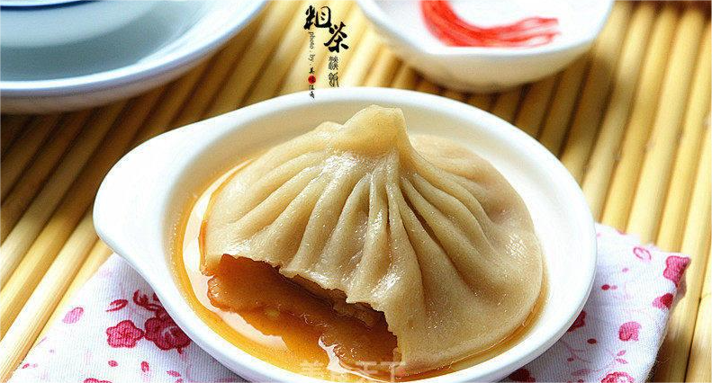

    灌汤包

 

 
<table style="border:none;">
    <tr>
        <th colspan="7"style="border:none;width: 850px">
            目录
        </th>
    </tr>
    <tr style="width: 500px; border:none;">
        <td style="border:none">
        美食历史
        </td>
        <td style="border:none">
        传说典故
        </td>
        <td style="border:none">
        食材做法
        </td>
        <td style="border:none">
        视频解析
        </td>
        <td style="border:none">
        音频解析
        </td>
        <td style="border:none">
        地图导览
        </td>
        <td style="border:none">
        营养价值
        </td>
    </tr>
</table>

## 美食历史

---

>灌汤包，是一种汉族特色小吃。制作原料主要有面粉、温水、猪五花肉等。早在北宋市场上已有售卖，当时称灌浆馒头或灌汤包子。著名产地开封。

## 传说典故

---

关于灌汤包有这样的一个传说。相传600多年前，元末明初，朱元璋起义攻打天下。
1356年朱元璋率领起义军打到浙江的金华城下，由于守城元兵早有防备，把城墙加高了七尺，另外还给城门加上了万斤闸。
起义军攻打了九天九夜，还是破不了城，只得在城外安营。朱元璋和他的部下大将常遇春、胡大海等十分焦急，白天夜里商议破城之法。
一天深夜，常大将军夜不成眠，在帐外踱步想着破城计策。忽然，他发现城门开了，万斤闸慢慢地升起，只见元兵押着一批民夫到江边偷偷地到江边挑水。常遇春连忙唤醒胡大海和起义士兵，冲向城门。
常大将军用肩膀顶住万斤闸，高喊到：“弟兄们，冲进城去啊！”顷刻间，起义军似千军万马，以排山倒海之势，一批接一批向城里冲去。常遇春肩顶万斤闸，时间长了，肚子饿得慌。
这时，恰好营里送来包子、菜汤等点心，常遇春就叫胡大海抽身给他喂包子、菜汤。常遇春真是饿慌了，一面狼吞虎咽地吃着包子，一面不停地催促：“汤，包子，汤，包子……”胡大海看着肩负万斤闸，汗流浃背的战友，喂着喂着顿生一计，令一士兵先将菜汤灌进包子，再把包子喂到战友嘴里。常遇春吃着，觉得喉咙湿润了，力量倍增。
直到士兵们都冲进了城里，他放下万斤闸。后来，常遇春问胡大海：“你那天给我喂的什么好吃的，使我力量倍增？”胡大海笑着说：“就是你叫的‘汤包’呀！”常遇春也笑着说：“如果没有你的汤包，我早就被万斤闸压趴下了。”后来，人们也就借着这个传说做出了灌汤包。

## 食材做法

---

**主要食材** 

<table>
    <tr>
        <td>面粉200g</td>
        <td>清水120g</td>
    </tr>
    <tr>
        <td>五花肉150g</td>
        <td>肉皮冻 100g</td>
    </tr>
    <tr>
        <td>葱花50g</td>
        <td>蚝油1勺</td>
    </tr>
    <tr>
        <td>鸡蛋1颗</td>
        <td>五香粉2g</td>
    </tr>
    <tr>
        <td>盐适量</td>
        <td>花椒水适量</td>
    </tr>
    <tr>
        <td>料酒适量</td>
        <td>老抽几滴</td>
    </tr>
</table>

<!--
| 面粉200g | 清水120g | 五花肉150g                                   |
|--------|--------|-------------------------------------------|
| 葱花50g  | 耗油1勺   | [肉皮冻](/laravel/base/materials/肉皮冻.md)100g |
| 鸡蛋1颗   | 五香粉2g  | 盐适量                                       |
| 料酒适量   | 花椒水适量  | 老抽几滴                                      | -->

**做法步骤** 
- **做法一** 
  **食材** 
  原料：新鲜猪皮500克，冬瓜600克，鱼糁150克，火腿30克，黄瓜皮30克，鸡蛋皮1张，生姜25克，大葱50克，精盐、胡椒粉、料酒、味精、鸡精、干湿淀
  粉、香油、鲜汤各适量，葱叶、红樱桃各少许。 
  **步骤** 

<table>
    <tr>
        <th>步骤</th>
        <th>具体操作</th>
    </tr>
    <tr>
        <td>步骤一</td>
        <td>猪皮洗净，放入高压锅中，掺入鲜汤，加入生姜、大葱、精盐、胡椒粉、料酒、鸡精，加盖，上火压至猪皮化成汁后，待冷却开盖，打去料渣，将汤汁倒
        入方形盘中，晾凉后再入冰箱中冷藏，即成皮冻，然后将其修切成直径为2厘米的圆球，共12个。</td>
    </tr>
    <tr>
        <td>步骤二</td>
        <td>冬瓜去皮，切成15厘米见方的大块，再片成大薄片，共12片，放入盐开水中浸泡约10分钟；火腿、黄瓜皮、蛋皮均切细丝；葱叶入沸水锅中焯一下，撕成细丝；红樱桃剁成细末。</td>
    </tr>
    <tr>
        <td>步骤三</td>
        <td>将修切成圆球的皮冻先滚上一层干淀粉，再裹上一层鱼糁，然后均匀地沾上火腿丝、黄瓜皮丝、蛋皮丝，将其包入浸泡过的冬瓜片中，再用葱叶丝捆扎成石榴包，并在上面点缀上樱桃末，即成水晶灌汤包生坯，入笼用旺火蒸约5分钟，取出摆入盘中。</td>
    </tr>
    <tr>
        <td>步骤四</td>
        <td>净锅上火，掺入少许鲜汤烧沸，调入精盐、胡椒粉、味精，用湿淀粉勾薄芡，淋入香油，起锅浇在盘中水晶灌汤包上即成。</td>
    </tr>
</table>

## 视频解析

---

<iframe width="956" height="538" src="https://www.youtube.com/embed/lVGp3WlCIg0" title="灌汤包 包法简单 不漏汤 不掉底 Soup Dumplings" frameborder="0" allow="accelerometer; autoplay; clipboard-write; encrypted-media; gyroscope; picture-in-picture; web-share" allowfullscreen></iframe>

## 放松音乐

---

<iframe frameborder="no" border="0" marginwidth="0" marginheight="0" width=330 height=86 src="//music.163.com/outchain/player?type=2&id=1887010461&auto=1&height=66"></iframe>

## 地图导览

---
[地图](https://www.google.com.hk/search?newwindow=1&tbs=lf:1,lf_ui:9&tbm=lcl&q=%E7%81%8C%E6%B1%A4%E5%8C%85%E5%9C%B0%E5%9B%BE&rflfq=1&num=10&rllag=22845856,113675447,46655&ved=2ahUKEwjp2uaowen9AhUNzqQKHYOFDAIQtgN6BAgPEAU)

## 营养价值

---

**小麦面粉** 
  面粉富含蛋白质、碳水化合物、维生素和钙、铁、磷、钾、镁等矿物质，有养心益肾、健睥厚肠、除热止渴的功效，主治脏躁、烦热、消渴、泄痢、痈肿、外伤出血及烫伤等。

**猪肉(肥瘦)** 
  猪肉含有丰富的优质蛋白质和必需的脂肪酸，并提供血红素(有机铁)和促进铁吸收的半胱氨酸，能改善缺铁性贫血;具有补肾养血，滋阴润燥的功效;但由于猪肉中胆固
  醇含量偏高，故肥胖人群及血脂较高者不宜多食。

**鸡蛋**
  鸡蛋含有丰富的蛋白质、脂肪、维生素和铁、钙、钾等人体所需要的矿物质，其蛋白质是自然界最优良的蛋白质，对肝脏组织损伤有修复作用;同时富含DHA和卵磷脂、
  卵黄素，对神经系统和身体发育有利，能健脑益智，改善记忆力，并促进肝细胞再生;鸡蛋中含有较多的维生素B和其他微量元素，可以分解和氧化人体内的致癌物质，
  具有防癌作用;鸡蛋味甘，性平;具有养心安神，补血，滋阴润燥之功效。

**肉皮清冻**
  猪皮中含有大量的胶原蛋白质，它在烹调过程中可转化成明胶。明胶具有网状空间结构，它能结合许多水，增强细胞生理代谢，有效地改善机体生理功能和皮肤组织细胞
  的储水功能，使细胞得到滋润，保持湿润状态，防止皮肤过早褶皱，延缓皮肤的衰老过程。

## 各地对比

---