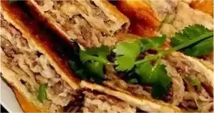

    濮阳壮馍

 

>胡辣汤和肉粥

<table style="border:none;">
    <tr>
        <th colspan="7"style="border:none;width: 850px">
            目录
        </th>
    </tr>
    <tr style="width: 500px; border:none;">
        <td style="border:none">
        美食历史
        </td>
        <td style="border:none">
        传说典故
        </td>
        <td style="border:none">
        食材做法
        </td>
        <td style="border:none">
        视频解析
        </td>
        <td style="border:none">
        音频解析
        </td>
        <td style="border:none">
        地图导览
        </td>
        <td style="border:none">
        营养价值
        </td>
        <td style="border:none">
        各地对比
        </td>
    </tr>
</table>

## 美食历史

---

>濮阳壮馍是河南濮阳著名的地方面食小吃，熟后的成品壮馍，色泽金黄，外焦内嫩，食之鲜而不膻，香而不腻。濮阳县的壮馍最好吃的是羊肉大葱的，趁热，油不算大，但由于是死面，多吃胀肚。
民谣：“圆圆小饼径尺长，根根馓条黄脆香。外软里酥饼卷馓，送与抗金英雄尝。”

## 传说典故

---

- **传说一** 
  相传，壮馍的由来是明洪武年间，开州之地有一位父母双亡，家道中落的书生寄宿在岳丈家中，备受岳丈嫌弃，其妻却对书生相濡以沫，感情深厚。恰逢皇帝恩科，书生
欲进京赶考，与岳丈商量。岳丈吝啬，只许与死面烙饼带于身侧作为路上充饥之用。妻子不忍，偷偷于饼内掺入肉馅，外皮于寻常烙饼无异。
后书生得中状元，御街夸官之时，朱元璋询问其有何愿望。状元提说：“愿再尝拙荆所做之烙饼足矣。”朱元璋好奇身为状元，什么山珍海味吃不到，为何单喜欢这粗粮
烙饼？问之，状元答：“此间滋味陛下一尝便知。”于是朱元璋下旨快马加鞭将状元夫人接入京城，择日献上此饼。
状元的巧夫人得知皇帝要吃她做的饼，怕做不好皇帝怪罪，则改良用小麦面，酵母半发面包裹肉馅，肉馅辅以大葱、粉皮去腻，包好后用鏊子煎炸至外表焦黄、内里爽滑
脆弹。朱元璋食后龙颜大悦，问夫人此为何名，夫人胆小：”尚未取名，是油炸的馍（地区叫法）”朱元璋说：既尚未取名，又是状元举荐的美食，就叫状元馍吧！“
  自此状元馍流传开来，但人们觉得对状元馍听着拗口就叫状馍，后因平民不识字，就演变成了强壮的壮。取其吃了可以强身健体等功效谓之”壮馍“
- **传说二** 
  始于隋末。之所以叫壮馍，一是因其用途。古代濮阳多战事，壮馍原是为战士上阵杀敌壮行之食物，故名“壮馍”。二是因其形状。一般壮馍的直径都在50公分左右，厚度5至7公分不等，每个壮馍重达10斤以上，是干粮中的“巨无霸”，烤制食品中的“大将军”。
  濮阳壮馍分荤、素两种，形如满月，色泽金黄，外焦里嫩，食之鲜而不腻，香而不腻。
  其中王五辈壮馍被誉为“濮阳百年名吃”。前国家主席李先念视察濮阳时，曾品尝王五辈壮馍，幷给予高度评价。2009年，王五辈壮馍被列入河南省省级非物质文化遗产名录。

## 食材做法

---

- **主要食材**

<table>
    <tr>
        <th>原料</th>
        <td>牛肉（或羊肉）</td>
        <td>粉条（或粉皮）</td>
        <td>面粉</td>
        <td></td>
        <td></td>
    </tr>
    <tr>
        <th>调料</th>
        <td>葱、姜、盐</td>
        <td>料酒</td>
        <td>酱油、香油</td>
        <td>五香粉</td>
        <td>味精</td>
</tr>
</table>

- **做法步骤**

<table>
  <tr>
    <th>步骤</th>
    <th>具体操作</th>
  </tr>
  <tr>
    <td>步骤一</td>
    <td>面粉1/3用开水烫匀，冷却后和成烫面团，2/3用清水和成面团，然后将两种面团和在一起，揉匀，醒30分钟。</td>
  </tr>
  <tr>
    <td>步骤二</td>
    <td>牛（羊）肉切成绿豆大小的粒，用刀粗略剁成肉馅；粉条（粉皮）用温水浸泡回软，切碎；葱、姜分别切碎。</td>
  </tr>
  <tr>
    <td>步骤三</td>
    <td>牛（羊）肉馅、粉条（粉皮）、葱、姜，加盐、料酒、酱油、五香粉、味精、香油拌匀成壮馍馅。</td>
  </tr>
  <tr>
    <td>步骤四</td>
    <td>面团揉匀，擀成圆片，放上拌好的馅，包裹好，做成厚度5-6cm、直径约60cm的圆饼，放平底锅中用小火半煎半烙（就是比一般烙的方法用油多些），两面金黄时即可。</td>
  </tr>
  <tr>
    <td>步骤五</td>
    <td>把面块分成每块重约600g的面剂，推擀成直径约22cm，厚3cm的圆形饼，上鏊勤翻转，俗称“三翻六转”，烙得火均匀，皮色微鼓时即熟，周围并有菊花形的毛边。</td>
  </tr>
</table>

## 视频解析

---

<iframe width="956" height="538" src="https://www.youtube.com/embed/y0XLppa_y5U" title="河南大叔做手工壮馍，一个饼卖100元塞满六斤肉，8个壮汉吃不完" frameborder="0" allow="accelerometer; autoplay; clipboard-write; encrypted-media; gyroscope; picture-in-picture; web-share" allowfullscreen></iframe>

## 放松音乐

---

<iframe frameborder="no" border="0" marginwidth="0" marginheight="0" width=330 height=86 src="//music.163.com/outchain/player?type=2&id=1991600175&auto=1&height=66"></iframe>

## 地图导览

---

[地图](https://gaode.com/search?query=%E6%BF%AE%E9%98%B3%E5%A3%AE%E9%A6%8D&city=440100&geoobj=113.265744%7C23.123672%7C113.277074%7C23.129434&zoom=17)

## 营养价值

 
 
 
 
 

