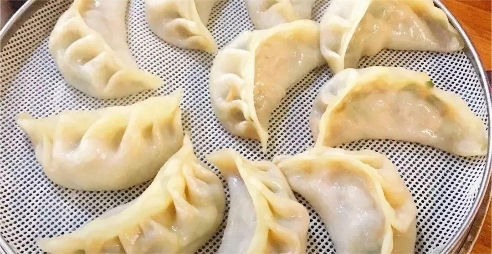

    新安烫面角

 

>胡辣汤和肉粥
---
<table style="border:none;">
    <tr>
        <th colspan="8"style="border:none;width: 850px">
            目录
        </th>
    </tr>
    <tr style="width: 500px; border:none;">
        <td style="border:none">
        美食历史
        </td>
        <td style="border:none">
        传说典故
        </td>
        <td style="border:none">
        食材做法
        </td>
        <td style="border:none">
        视频解析
        </td>
        <td style="border:none">
        音频解析
        </td>
        <td style="border:none">
        地图导览
        </td>
        <td style="border:none">
        营养价值
        </td>
        <td style="border:none">
        各地对比
        </td>
    </tr>
</table>

## 美食历史

---
>传统风味小吃新安烫面角，创制于民国三年（1914），已有80多年历史。时有开封人任老大与本县人王金斗，于新安县火车站开设餐馆，出售“老任烫面角”。由于配方
科学，制作讲究，所制烫面角软皮紧，晶莹欲滴，状如新月，色如琼玉，鲜香不腻，味美可口，时有“名扬陇海三千里，味压河洛第一家”的美誉。任老大故世后，王金斗改
字号为“老王烫面角”，其子王德法承袭父业，使这一风味小吃得以发展。1980年，王德法曾应邀赴郑州传艺。至今，洛阳、郑州等地都有专营“新安县烫面角”餐馆。近年，
新安“方记烫面角”在传统工艺的基础上又有创新，风味更佳，1986年以来，多次被评为“洛阳市名小吃”，并于1993年应邀参加北京迎“亚运”美食节，受到广泛赞誉。制
作工艺：若把烫面角做到角软皮紧，晶莹欲滴，状如新月，色如琼玉时，那就达到最高境界了！
 

## 传说典故

---

特色传说：创制于民国三年（1914），已有80多年历史。时有开封人任老大与本县人王金斗，于新安县火车站开设餐馆，出售“老任烫面角”。有“名扬陇海三千里，味压河洛第一家”的美誉。

## 食材做法

---

- **主要食材** 

<table>
    <tr>
        <th>食材</th>
        <td>精白粉</td>
        <td>大葱</td>
        <td>韭黄</td>
        <td>白菜心</td>
        <td>鲜猪肉</td>
    </tr>
    <tr>
        <th>调料</th>
        <td>盐</td>
        <td>白糖</td>
        <td>料酒</td>
        <td>小磨香油</td>
        <td>味精</td>
    </tr>
</table>

- **做法步骤**

>精选胛臀处的鲜猪肉，肥瘦适量，剁肉成末，加多种调料与原汁肉汤搅成馅；再用鲜开水把面烫好，擀成皮，包成状如新月的面饺，上笼清蒸10分钟即成。

## 视频解析

---

> 做法视频暂无，仅展示相关内容。

<iframe width="1128" height="634" src="https://www.youtube.com/embed/A2atdo24C9Q" title="函谷关旅行路上的洛阳新安美食 烫面角" frameborder="0" allow="accelerometer; autoplay; clipboard-write; encrypted-media; gyroscope; picture-in-picture; web-share" allowfullscreen></iframe>

## 放松音乐

---

<iframe frameborder="no" border="0" marginwidth="0" marginheight="0" width=330 height=86 src="//music.163.com/outchain/player?type=2&id=486999043&auto=1&height=66"></iframe>

## 地图导览

---

[地图](https://www.google.com.hk/search?newwindow=1&tbs=lf:1,lf_ui:9&tbm=lcl&q=%E6%96%B0%E5%AE%89%E7%83%AB%E9%9D%A2%E8%A7%92&rflfq=1&num=10&rllag=34678279,112458149,1748&ved=2ahUKEwjJ2J6loOz9AhW3IUQIHSdqBvsQtgN6BAgLEAU)

## 营养价值

 
 
 
 
 