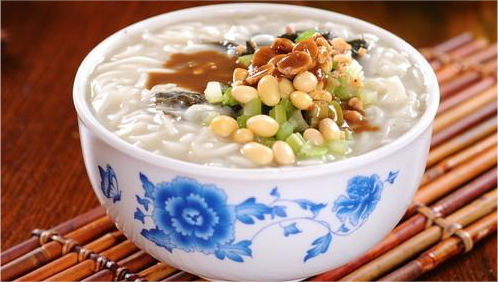

    洛阳酸浆面条

 

 

<table style="border:none;">
    <tr>
        <th colspan="8"style="border:none;width: 850px">
            目录
        </th>
    </tr>
    <tr style="width: 500px; border:none;">
        <td style="border:none">
        美食历史
        </td>
        <td style="border:none">
        传说典故
        </td>
        <td style="border:none">
        食材做法
        </td>
        <td style="border:none">
        视频解析
        </td>
        <td style="border:none">
        音频解析
        </td>
        <td style="border:none">
        地图导览
        </td>
        <td style="border:none">
        营养价值
        </td>
        <td style="border:none">
        各地对比
        </td>
    </tr>
</table>

## 美食历史

---

>浆面条（也叫酸面条，其原因是发酵后的浆酸味十足），河南洛阳的传统名吃。是以绿豆浆发酵制作面浆，经特殊工艺而成的面条。洛阳、汝州、新郑、唐河等地浆面条，
制作简单，成本低、味道美、易于消化，酸味独特，咸香适口，因而自古以来流传不衰，成为颇具浓厚地方特色的地方名食。浆面条不同于浆水面。
## 传说典故

---
- **传说一** 
  >这浆面条是起源于河南省洛阳市，当时是以豌豆浆面条著称，历史悠久。据传在明朝正德年间，该县一个姓史的人开了个饭店，生意很兴隆。有一年小麦欠收，豌豆丰
   收，饭店天天卖豌豆面饭，一时生意萧条。一天，京城一位钦差大臣带随从路过此店吃饭，店主因无上等米菜下锅急得团团转。当他看到盆里磨碎的豌豆和桌上的面条
   时，急中生智，用椒叶、藿香等作作料，用豌豆浆作汤下入面条，做了一锅豌豆浆面条。钦差大臣吃后十分满意。此后店主便新增了浆面条这一食谱，小店生意又兴旺
   起来，从此，这浆面条便成了河南的一道名吃。
- **传说二** 
  >相传，东汉年间，光武帝刘秀为躲避王莽追杀，日夜奔走，数日水米未进。一日深夜行至洛阳附近，见到一户人家。便想讨些饭食，可主人贫穷，只有几把干面条，一些
  已经放酸的绿豆磨的浆水。刘秀饥饿难耐也顾不了许多，主人就用酸浆，把面条、菜叶、杂豆下入锅内烧熟。刘秀狼吞虎咽，竟然觉得香气扑面而来，吃得那叫津津有味
。日后刘秀当了皇帝，虽然有山珍海味伺候，却依然对当年落难中的浆面条念念不忘，以至于御宴中就有了浆面条这道菜。
- **传说三** 
  >据说清朝末年洛阳一穷户人家，将捡来的绿豆磨成豆浆，隔了数日，发现豆浆发馊变酸，倒了舍不得，遂胡乱丢些菜叶，熬成糊状，一吃味道鲜美，后来家家效仿。旧
  社会洛阳穷人多，一般人家买不起面粉。常常以菜代面。花个三五分钱上街舀两瓢酸浆，回家做浆饭。切少许萝卜丝或白菜叶下锅，待浆起沫后勾点面粉，稠稠的，谓之
  “挑浆饭”。若再下点小米，谓之“浆米气儿”。每到饭时，满院飘香。孩子们闻到浆味儿，兴奋异常。三碗两碗，风卷残云。若此时家中来客，浆饭招待，那比请他吃大
  鱼大肉还过瘾。当然一般小康之家做浆面条儿讲究了：白面条、芹菜、大绿豆、（或油炸花生米），再佐以韭菜花或辣椒油，绿白红酸得辣，生生能把人的馋虫给勾了去，
  “剩浆面条儿”是浆饭中的上吕，民谚云：“浆饭热三遍，拿肉都不换”可见其魅力。

  >经过数百年的改良，眼下粉浆面条的制作方法是非常考究的，浆面条，顾名思义，是以面条为主料，但这种面条用的不是上等的面粉，正宗的多为一些杂粮面，面条一
  定要细。最重要的一点是这辅料-粉浆，这粉浆的好坏，直接决定整个小吃的味道。

  >做浆时，先把绿豆或豌豆用水浸泡，膨胀后放在石磨上磨成粗浆，用纱布过滤去渣，然后放在盆中或罐里。一两天后，浆水发酵变酸，粉浆就做好了。做时把酸浆倒在锅
  里煮至80℃的时候，浆水的表层泛起一层白沫．这时，要用勺子轻轻打浆，浆沫消失后，浆体就变得细腻光滑，接着再下面条等其他调料即可。

  >另外一种辅料是芝麻叶，一般我们做面条时都是放青菜的，但正宗粉浆面条里放的都是芝麻叶，但芝麻叶不太好做，也很难找，很多人都用芹菜叶代替。芝麻叶要选初
  长成叶的叶心，洗干净之后，用开水焯一下，然后放在阴凉的地方晒干保存起来备用。

  >如今方城县的粉浆面条已被洛阳粉浆面条所代替，洛阳人的吃法也是非常讲究的，以前的面条里的配菜基本都是黄豆、芹菜、咸菜丝老三样，但眼下基本上都是十几种时
  令小菜，像酸白菜丁、黄瓜丁、芹菜丁、胡萝卜丁、白萝卜丁，小尖椒、榨菜丝、雪菜丁、黄豆等等 ，不过这些都是事先腌制好的，已经入了味，可见下的功夫非同一般，所以，这吃起来，味道不用再说了。
  浆面条传承千年，流传至今。当前，[洛阳水席](../../laravel/base/relevance/洛阳水席.md)（一道名吃）与洛阳牡丹和洛阳龙门齐名，被称为洛阳的三绝，在洛阳水席中就有浆面条这道面食。
## 食材做法

---

 
- **主要食材**

<table>
    <tr>
        <th colspan="4">食材</th>
        <th colspan="5">辅料</th>
    </tr>
    <tr>
        <td>面条</td>
        <td>芹菜</td>
        <td>黄豆</td>
        <td>花生</td>
        <td>盐</td>
        <td>香油</td>
        <td>花椒</td>
        <td>五香粉</td>
        <td>浆面条料包</td>
    </tr>
</table>

- **做法步骤**

<table>
    <tr>
        <th>步骤</th>
        <th>具体做法</th>
    </tr>
    <tr>
        <td>步骤一</td>
        <td>黄豆提前泡好，和花生米一起煮熟，捞出备用，芹菜洗净切小段</td>
    </tr>
    <tr>
        <td>步骤二</td>
        <td>锅中倒油，放入少许花椒煎一下捞出</td>
    </tr>
    <tr>
        <td>步骤三</td>
        <td>随后倒入黄豆和花生米翻炒片刻，再倒入芹菜、盐、鸡精翻炒几分钟即可</td>
    </tr>
    <tr>
        <td>步骤四</td>
        <td>锅中倒入浆面条粉，加入凉水1800ml，划开</td>
    </tr>
    <tr>
        <td>步骤五</td>
        <td>烧开后倒入香油顺着一个方向搅匀，再放入面条，放入五香粉和花椒粉</td>
    </tr>
    <tr>
        <td>步骤六</td>
        <td>面条煮至9分熟时，倒入炒好的菜搅匀，关火前放入拍碎的大蒜，喜欢吃辣的可以再放入油辣椒</td>
    </tr>
</table>

## 视频解析

---

<iframe width="956" height="538" src="https://www.youtube.com/embed/BnYsm49AC6o" title="河南小吃之浆面条的做法" frameborder="0" allow="accelerometer; autoplay; clipboard-write; encrypted-media; gyroscope; picture-in-picture; web-share" allowfullscreen></iframe>

## 放松音乐

---

<iframe frameborder="no" border="0" marginwidth="0" marginheight="0" width=330 height=86 src="//music.163.com/outchain/player?type=2&id=430685732&auto=1&height=66"></iframe>

## 地图导览

---

[地图](https://ditu.amap.com/search?query=%E9%85%B8%E6%B5%86%E9%9D%A2%E6%9D%A1&city=000000&geoobj=-117.859042%7C34.12324%7C-117.848324%7C34.128427&zoom=17)
## 营养价值

---
**1.开胃消食**

>酸浆面条是一种能开胃消食的特色美食，它还有多种酸性成分和一些活性酶，人们使用它后能促进消化液分泌，并能刺激肠胃，能加快他们对身体内食物的消化与吸收，对人类经常出现的食欲不振和消化不良以及食少腹胀等症都有良好调理作用。

**2.杀菌消炎**

>酸浆面条中还有一些活性成分和一些药用成分，他们能消灭人体肠胃中的细菌与炎症，并能增强人体的抗菌能力，平时人们食用能预防肠胃炎和肠道感染等疾病发生，它对维持人类肠胃健康有很大的好处。另外酸浆面条还能保持人类大便正常，它能预防缓解便秘也能防止人体出现肥胖。

**3.补充营养**

>酸浆面条是一种营养价值极高的特色美食，人们使用它后能吸收丰富植物蛋白和多种维生素，还能吸收一些矿物质与活性成分这些营养被人体吸收后能促进人体代谢，提高身体各个器官功能，并能延缓人体衰老，它能满足人体各器官正常工作时，对不同营养的需要对维持人体健康有很大的好处。

**4.补益脾胃**

>酸浆面条还能补益脾胃预防缓解脾胃不和，人类因脾胃虚弱和脾胃不和导致的消化不良时少症状以及腹痛等症都有良好调理作用，另外酸浆面条还能去除油腻，人们在食用是高脂肪的食物以后多吃一些酸浆面条能加快身体内脂肪的分解与代谢能阻止脂肪在身体内淤积，它能在祛除油腻促进消化的同时防止三高症状发生。
## 各地对比

---

 
 
 
 
 