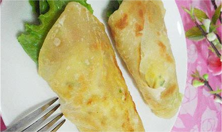

    鸡蛋灌饼

 

>河南信阳特色美食

<table style="border:none;">
    <tr>
        <th colspan="8"style="border:none;width: 850px">
            目录
        </th>
    </tr>
    <tr style="width: 500px; border:none;">
        <td style="border:none">
        美食历史
        </td>
        <td style="border:none">
        传说典故
        </td>
        <td style="border:none">
        食材做法
        </td>
        <td style="border:none">
        视频解析
        </td>
        <td style="border:none">
        音频解析
        </td>
        <td style="border:none">
        地图导览
        </td>
        <td style="border:none">
        营养价值
        </td>
        <td style="border:none">
        各地对比
        </td>
    </tr>
</table>

## 美食历史

---

>[鸡蛋](../../laravel/base/materials/鸡蛋.md)灌饼是用鸡蛋、面粉制作的一道小吃，它是源于河南信阳的特色传统名点，深受当地居民喜爱。把鸡蛋液灌进烙至半熟的饼内，继续煎烙后烤制而成，饼皮酥脆蛋鲜香。
鸡蛋灌饼也算一种早餐，有蛋有面有青菜有营养又方便很受大家欢迎，是河南地区的特色小吃之一。

## 传说典故

---

  >传说有一位书生进京赶考，路过罗山，来到灵山脚下。在灵山寺前的台阶上，这位年轻的书生，面容温润，眼睛清澈明亮，当他在路边游荡时，看到了一位少女，少女的微
笑牵动了书生的心。从那一天起，书生就一直在想这个女孩。虽然书生为了考试而苦读诗书，但他得空就去灵山寺附近的村庄去找那个女孩，但最终还是没有找到。
  
  >等考试日期到了，书生整理好行李，心里还是郁郁寡欢，就出门散步，走了许久肚子不由自主地饿了，于是找到一家人讨口水喝，谁料到，开门的人竟是梦中的那个少女，
书生惊喜不已，久久相望不能自拔。
  
  >少女的父亲问书生出了什么事，书生如实地告诉他，少女很高兴地给书生倒了茶，还担心他饿了，从鸡舍里拿出两个鸡蛋，在地上拔出一根葱，烙饼子时两张饼合在一起，
中间刷上油，用筷子在饼上戳了个小洞，然后把鸡蛋打散倒进饼里，然后逐渐演变成今天的鸡蛋灌饼。

## 食材做法

---

**做法一** 
  - **主要食材** 

<table>
    <tr>
        <th colspan="3">主料</th>
        <th colspan="5">辅料</th>
    </tr>
    <tr>
        <td>面粉</td>
        <td>鸡蛋</td>
        <td>生菜</td>
        <td>海鲜酱</td>
        <td>蒜蓉辣酱</td>
        <td>红油豆瓣酱</td>
        <td>鸡精</td>
        <td>味精</td>
    </tr>
</table>

  - **做法步骤**

<table>
    <tr>
        <th>步骤</th>
        <th>具体内容</th>
    </tr>
    <tr>
        <td>步骤一</td>
        <td>将面粉用凉水和成面团后醒发10分钟，取少许面粉，用食用油，加少许盐调成稀油酥备用</td>
    </tr>
    <tr>
        <td>步骤二</td>
        <td>取出醒好的面团，加入四分之一的烫面，一起和均匀，揉成条后下剂，逐个抹上稀油酥，包紧后再次醒发片刻，将饼坯擀成饼，平锅中加少许油，至油温5成热时下入面饼，煎至饼起泡时从中间扎破，将打散的鸡蛋灌入，煎至两面金黄出锅，海鲜酱加蒜蓉辣酱，用少许油调匀，抹在饼上，加入生菜即可食用。</td>
    </tr>
</table>

**做法二**
 - **主要食材**

<table>
    <tr>
        <th colspan="5">主料</th>
        <th colspan="5">辅料</th>
    </tr>
    <tr>
        <td>面粉</td>
        <td>鸡蛋</td>
        <td>胡萝卜</td>
        <td>火腿</td>
        <td>生菜</td>
        <td>盐</td>
        <td>水</td>
        <td>生抽</td>
        <td>料酒</td>
        <td>葱末</td>
    </tr>
</table>

 - **做法步骤**

<table>
    <tr>
        <th>步骤</th>
        <th>具体做法</th>
    </tr>
    <tr>
        <td>步骤一</td>
        <td>面粉倒入容器中，加入3克盐和温水搅拌成团，醒20分钟</td>
    </tr>
    <tr>
        <td>步骤二</td>
        <td>面粉加色拉油和成油酥，稍成形就可以了，鸡蛋打散在碗中，倒入其他调料搅拌好</td>
    </tr>
    <tr>
        <td>步骤三</td>
        <td>将醒好的面团分成四份，取其中一份，按扁（这里按扁就可以，不用擀圆）。包入油酥，包好收口，将收口朝下，用擀面棍擀圆</td>
    </tr>
    <tr>
        <td>步骤四</td>
        <td>把温度调到自己合适温度，温度够了，将饼放入10秒钟后翻面，见饼鼓起，用筷子挑起一个角，将鸡蛋液倒入，翻面将两边烙成金黄色。</td>
    </tr>
</table>

## 视频解析

---

<iframe width="956" height="538" src="https://www.youtube.com/embed/YVDFbWR_h5A" title="鸡蛋灌饼" frameborder="0" allow="accelerometer; autoplay; clipboard-write; encrypted-media; gyroscope; picture-in-picture; web-share" allowfullscreen></iframe>

## 放松音乐

---

<iframe frameborder="no" border="0" marginwidth="0" marginheight="0" width=330 height=86 src="//music.163.com/outchain/player?type=2&id=1893321422&auto=1&height=66"></iframe>

## 地图导览

---

## 营养价值

---

>鸡蛋灌饼的营养价值也是很丰富的，生菜中含有甘露醇等有效成分，有利尿和促进血液循环的作用。生菜中膳食纤维和维生素C较白菜多，有消除多余脂肪的作用，故又叫
减肥生菜。鸡蛋黄中的卵磷脂、甘油三脂、胆固醇和卵黄素，对神经系统和身体发育有很大的作用。卵磷脂被人体消化后，可释放出胆碱，胆碱可改善记忆力。鸡蛋中含有
较多的维生素B2，可以分解和氧化人体内的致癌物质。鸡蛋中的微量元素，如硒、锌等也都具有防癌作用。鸡蛋性味甘、平，归脾、胃经，可补肺养血、滋阴润燥，用于气
血不足、热病烦渴、胎动不安等，是扶助正气的常用食品。

## 各地对比

---

 
 
 
 
 