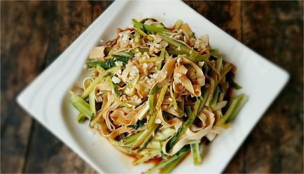
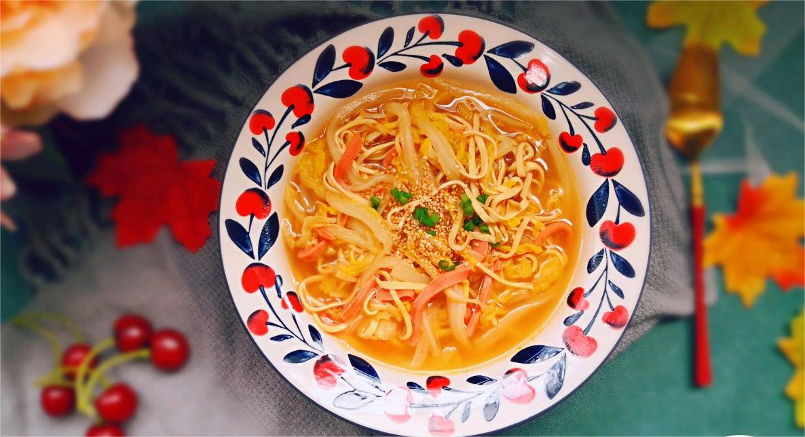

    千张丝

 

 
<table style="border:none;">
    <tr>
        <th colspan="5"style="border:none;width: 850px">
            目录
        </th>
    </tr>
    <tr style="width: 500px; border:none;">
        <td style="border:none">
        食材简介
        </td>
        <td style="border:none">
        美食菜品
        </td>
        <td style="border:none">
        营养功效
        </td>
        <td style="border:none">
        食材禁忌
        </td>
        <td style="border:none">
        音频解析
        </td>
    </tr>
</table>

## 食材简介

---

>千张丝是一种豆制品，由于在特质工具内层层压制，出品时候看起来有千百张叠加在一起而在安徽等地称为千张，我国北方某些地方称为干豆腐。切成丝后便成了千张丝。

>它是一种特殊的豆制食品，是一种薄的豆腐丝，可以理解成一片特别大特别薄有一定韧性的豆腐干切成丝，色米黄，可凉拌，可清炒，可煮食。湖北有名菜“[千张肉丝](../../../laravel/base/relevance/千张肉丝.md)”，
即以千张为原料。适宜身体虚弱，营养不良，气血双亏，年老赢瘦之人食用；适宜高脂血症，高胆固醇，肥胖者及血管硬化者食用。豆腐丝中含有丰富蛋白质，而且豆腐蛋
白属完全蛋白，不仅含有人体必需的8种氨基酸，而且其比例也接近人体需要，营养价值较高。

## 美食菜品

---

    

        
        
青椒炒千张

    

    

         
        
凉拌千张丝

    

    

        
        
银鱼千张汤

    

    

         
        
韭菜炒千张

    

         
        
麻辣千张丝

    

 
 
 
 
 
 
 
 
 
 
 

## 营养功效

---

>千张中含有丰富的蛋白质、不饱和脂肪酸、卵磷脂、维生素、钙、铁、锌、镁等矿物质，营养十分丰富，可以为人体补充多种营养；

>**功效** 
>1. **补中益气、清热降燥** 
   千张味道比较甘甜，但属于寒性物质，所以千张有补阴清热的作用，经常食用还可以补中益气，清热润燥、生津止渴、清洁肠胃的作用。千张适合热性体质的人食用，可以除口臭口渴、治疗肠胃的功效，并且可以用于病后的调养。
>2. **补血养颜**  
   千张有造血的作用，因为千张中含有大量的铁，可以增加造血功能中血液里的铁含量，同时其还有淡化斑点的作用，因为千张含有植物雄激素，可以改善更年期综合症，故千张有补血养颜的作用，适合女性经常食用。
>3. **强壮骨骼** 
   千张里含有大量的营养成分同时利于肠胃吸收，其中的钙含量尤为高，对于牙齿和骨头的生长有很大的益处，可以强壮骨骼，除此之外，千张中有大豆类的黄酮成分会有效地预防骨质疏松。
>4. **补脑健脑** 
   千张里含有丰富的大豆类的蛋白质以及卵磷脂，可有有益于神经组织、血管和大脑的生长发育，同时有增强免疫力和强身健脑的作用。
>5. **预防疾病** 
   千张里含有卵磷脂，会除掉血管上的胆固醇，可以防止血管的硬化还可以预防结肠癌，还可以有效地预防心血管疾病，有效地保护心脏。

## 食材禁忌

---
**人群适宜和禁忌**

  - **适宜人群**

  适宜身体虚弱，营养不良，气血双亏，年老赢瘦之人食用；适宜高脂血症，高胆固醇，肥胖者及血管硬化者食用；适宜糖尿病人食用；适宜妇女产后乳汁不足之人食用；
适宜青少年儿童食用；适宜痰火咳嗽哮喘（包括急性支气管炎咳喘）之人食用；适宜癌症患者食用；千张最宜老人食用。

  - **禁忌人群**

  幼儿、婴儿人群应忌食或少食；有妇科疾病者勿食。

**同食适宜和禁忌**
  - **同食适宜**

    1.千张+香菜：香菜可以消食下气、壮阳助兴的功效，和千张一起食用有益于病后恢复，身体虚弱的症状。 
    2.千张+生姜：生姜和千张一起食用有驱寒补暖、治疗胃寒腹泻的功效。

  - **同食禁忌** 

    1.千张+菠菜：菠菜中含有草酸，草酸和钙一起会形成一种难溶物，故会影响钙的吸收，所以菠菜和千张一起食用会营养千张里钙的吸收，从而不利于补钙的作用。
    2.千张+蜂蜜：蜂蜜和千张一起食用会影响千张里的营养，同时还会有损听力，严重的话还会造成腹泻等肠胃问题。

## 放松音乐

---

<iframe frameborder="no" border="0" marginwidth="0" marginheight="0" width=330 height=86 src="//music.163.com/outchain/player?type=2&id=1893321422&auto=1&height=66"></iframe>

 
 
 
 
 