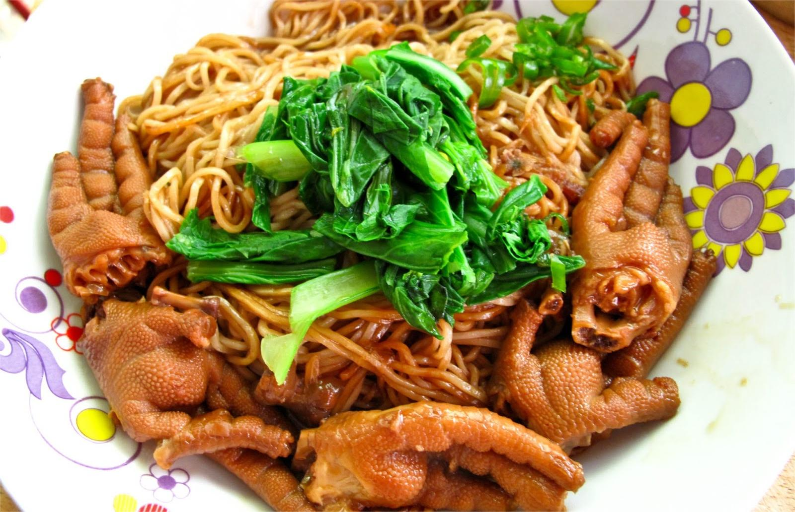

    卤水

 

<table style="border:none;">
    <tr>
        <th colspan="5"style="border:none;width: 850px">
            目录
        </th>
    </tr>
    <tr style="width: 500px; border:none;">
        <td style="border:none">
        食材简介
        </td>
        <td style="border:none">
        美食菜品
        </td>
        <td style="border:none">
        食材营养
        </td>
        <td style="border:none">
        功效禁忌
        </td>
        <td style="border:none">
        音频解析
        </td>
    </tr>
</table>

## 食材简介

---

>卤水的基础是酱油，再加入多种香料烹调而成。所选用的香料没有既定标准，较常见的包括花椒、八角、陈皮、桂皮、甘草、草果、姜、南姜、沙姜、葱及冰糖等，其中
南姜是正宗潮汕卤水必不可少的调味品。也有加入辣椒成为川味的卤水。自行制作卤水并不复杂，一般只需把酱油与香料一起烹调即成，但要把卤水的味道调配得恰到好处 ，
并使其后卤制的食物带有酱油与香料的芳香就不容易，因此卤味食品店常把卤水的调配方法视为秘方。

>卤水是制作卤味食品的基础，当卤水煮滚后，并可加入各种耐煮的食材，使食材吸收卤水的味道，便能把食材烹调为卤味。常见的卤味食材有鸭、鹅、猪手、家禽内脏、牛杂和豆腐等。

## 美食菜品

---

    

        
        
卤水鸭翅

    

    

         
        
卤水点豆腐

    

    

        
        
卤水排骨

    

    

         
        
卤水豆腐蛋

    

         
        
卤水鸡爪面

    

 
 
 
 
 
 
 
 
 
 
 

## 食材营养

---

| 营养成分     | 微量元素（每100克） |
|----------|-------------|
| 热量203千卡  | 钠11500毫克    |
| 碳水化合物30克 ||
| 脂肪2克     ||
| 蛋白质4.2克  ||

>卤水低胆固醇，低饱和脂肪酸，但钠盐含量过高，所以不宜经常食用。

## 功效禁忌

---

>盐卤对皮肤、粘膜有很强的刺激作用，对中枢神经系统有抑制作用，不可直接食用，人如不小心误服，会感觉恶心呕吐、口干、胃痛、烧灼感，腹胀、腹泻，头晕，头痛，出皮疹等，严重者呼吸停止，出现休克，甚至造成死亡。

## 放松音乐

---

<iframe frameborder="no" border="0" marginwidth="0" marginheight="0" width=330 height=86 src="//music.163.com/outchain/player?type=2&id=1893321422&auto=1&height=66"></iframe>

 
 
 
 
 