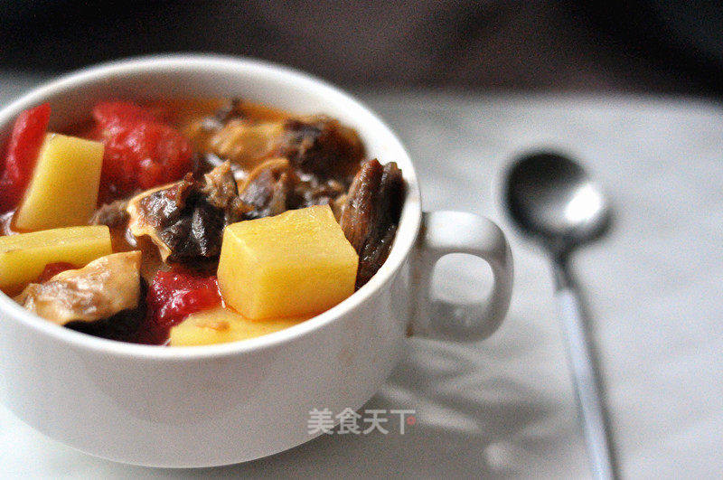

### [返回](../../../1.%20河南烩面.md#美食历史)

    土豆

 

<table style="border:none;">
    <tr>
        <th colspan="5"style="border:none;width: 850px">
            目录
        </th>
    </tr>
    <tr style="width: 500px; border:none;">
        <td style="border:none">
        食材简介
        </td>
        <td style="border:none">
        美食菜品
        </td>
        <td style="border:none">
        食材营养
        </td>
        <td style="border:none">
        功效禁忌
        </td>
        <td style="border:none">
        音频解析
        </td>
    </tr>
</table>

## 食材简介

---

>土豆：又称马铃薯（拉丁学名：Solanum tuberosum，英文：Potato）又叫山药蛋、地蛋、洋芋、荷兰薯等，是茄科茄属的一年生草本植物。地上茎呈菱形，有毛。叶片
初生时为单叶，逐渐生长成奇数不相等羽状复叶，大小相间，呈卵形至长圆形；伞房花序生长在顶部，花为白色或蓝紫色；果实为浆果；块茎扁圆形或球形，无毛或被疏柔
毛；薯皮白色、淡红色或紫色；薯肉有白、淡黄、黄色等色；花期夏季。马铃薯因酷似马铃铛而得名。

## 美食菜品

---

    

        
        
土豆丝饼

    

    

         
        
土豆炖牛腩

    

    

        
        
蒸土豆丝

    

    

         
        
奶油土豆泥

    

         
        
酸辣土豆丝

    

 
 
 
 
 
 
 
 
 
 
 

## 食材营养

---

>土豆具有很高的营养价值和药用价值，其营养素丰富，含有蛋白质、矿物质(磷、钙等)、维生素等多种成分，营养结构也较合理，有“地下苹果”之称。 
它所含的蛋白质和维生素C、维生素B1、维生素B2比苹果高得多：
1. 维生素C是苹果的10倍。
2. B族维生素是苹果的4倍。
3. 钙、磷、镁、钾含量是苹果的几倍至几十倍不等，尤其是钾的含量，可以说在蔬菜类里排第一位。
4. 富含大量碳水化合物，能供给人体大量的热能。
5. 土豆的皮富含绿原酸和硫辛酸。绿原酸有抗氧化和抗癌的功效，硫辛酸可淡斑、防止皮肤老化。
6. 含有能够帮助预防老年疾病的膳食抗氧化剂以及有大量的优质纤维素，有预防便秘和防治癌症等作用。

>每百克土豆营养元素含量：

| 营养名称  | 含量      | 营养名称 | 含量      | 营养名称 | 含量     |
|-------|---------|------|---------|------|--------|
| 热量    | 76（大卡）  | 钾    | 342（毫克） | 磷    | 40（毫克） |
| 胡萝卜素  | 30（微克）  | 维生素C | 27（毫克）  | 镁    | 23（毫克） |
| 碳水化合物 | 17.2（克） | 钙    | 8（毫克）   | 维生素A | 5（微克）  |
| 蛋白质   | 2（克）    | 膳食纤维 | 0.7（克   | 脂肪   | 0.2（克） |

## 功效禁忌

---

>土豆味甘、性平、微凉，入脾、胃、大肠经，具有有和胃调中，健脾利湿，解毒消炎，宽肠通便，降糖降脂，活血消肿，益气强身，美容，抗衰老等功效，是一种很适合食用的食材。
土豆主治胃火牙痛、脾虚纳少、大便干结、高血压、高血脂等病症；还可辅助治疗消化不良、习惯性便秘、神疲乏力、慢性胃痛、关节疼痛、皮肤湿疹等症。

>1.**宽肠通便** 
 土豆含有大量膳食纤维，能宽肠通便，帮助机体及时排泄代谢毒素，防止便秘，预防肠道疾病的发生；

>2.**和中养胃、健脾利湿：** 
 土豆含有大量淀粉以及蛋白质、B族维生素、维生素C等，能促进脾胃的消化功能。

>3.**降糖降脂、美容养颜：** 
 土豆能供给人体大量有特殊保护作用的黏液蛋白。能促持消化道、呼吸道以及关节腔、浆膜腔的润滑，预防心血管和系统的脂肪沉积，保持血管的弹性，有利于预防动脉粥样硬化的发生。土豆同时又是一种碱性蔬菜，有利于体内酸碱平衡，中和体内代谢后产生的酸性物质，从而有一定的美容、抗衰老作用；

>4.**补充营养、利水消肿：** 
 土豆含有丰富的维生素及钙、钾等微量元素，且易于消化吸收，营养丰富，在欧美国家特别是北美，土豆早就成为第二主食。土豆所含的钾能取代体内的钠，同时能将钠排出体外，有利于高血压和肾炎水肿患者的康复。

>**适用人群** 
土豆一般人均可食用。特别适合动脉硬化、胆结石症患者、肥胖患者、孕妇及有消化道溃疡的人食用。特殊人群，如孕妇、产妇、婴儿都能吃土豆。 
孕妇能吃土豆。土豆是很优质的主食食材，长期替代一部分粮食也不会引起营养缺乏问题，还能供应更丰富的钾、镁和维生素C。但要注意土豆吃多了容易胀气，所以孕妇吃
土豆，应该要适量地吃，不能一次食用过多。此外，不能吃发芽的、变绿的、久放的土豆，以防食物中毒。 
产妇能吃土豆。土豆能供应更丰富的钾、镁和维生素C。但要注意土豆吃多了容易胀气。此外，不能吃发芽的、变绿的、久放的土豆，以防食物中毒。 
婴幼儿能吃土豆。给婴幼儿添加辅食阶段，可土豆制成土豆泥少量食用。土豆能促进肠壁的蠕动，帮助消化，防止大便干燥，刺激排便。 
但也有部分人不适宜食用土豆，皮肤瘙痒性疾病、眼部充血患者就应忌食土豆。

>**注意事项** 
食用土豆时要注意凡腐烂、霉烂或生芽较多的土豆，因含过量龙葵素，极易引起中毒，一律不能食用。土豆宜去皮吃，有芽眼的部分应挖去，以免中毒。土豆切开后容易氧化变黑，属正常现象，不会造成危害。烹调时注意不要把土豆泡得太久，这样会致使水溶性维生素等营养流失。

## 放松音乐

---

<iframe frameborder="no" border="0" marginwidth="0" marginheight="0" width=330 height=86 src="//music.163.com/outchain/player?type=2&id=1893321422&auto=1&height=66"></iframe>

 
 
 
 
 

