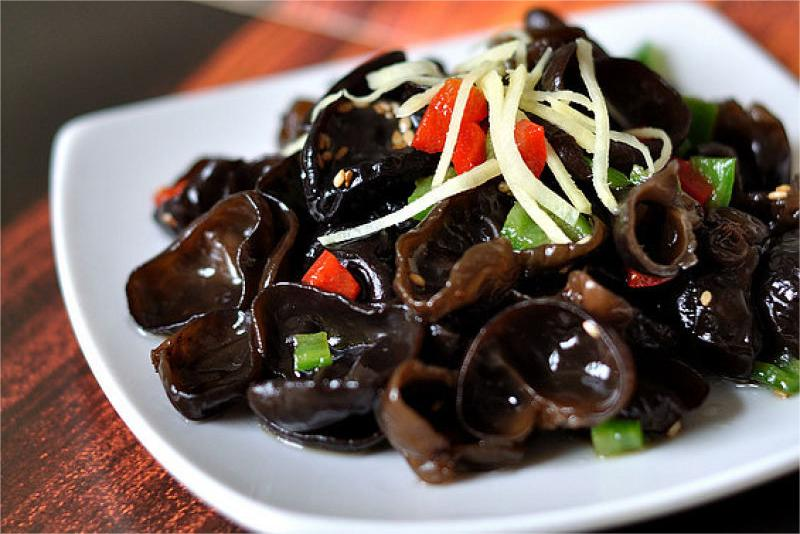
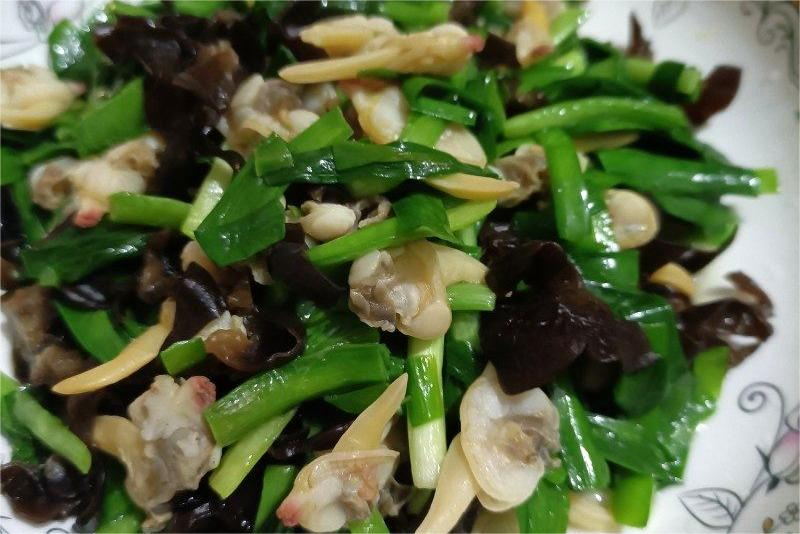
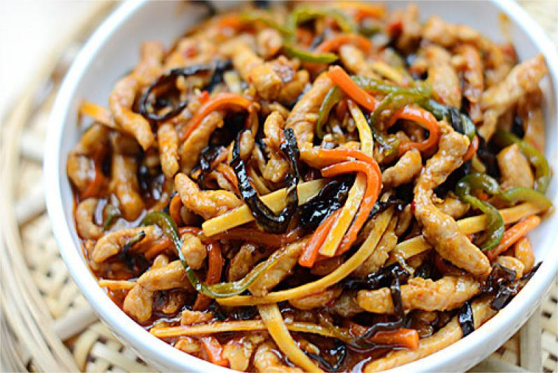
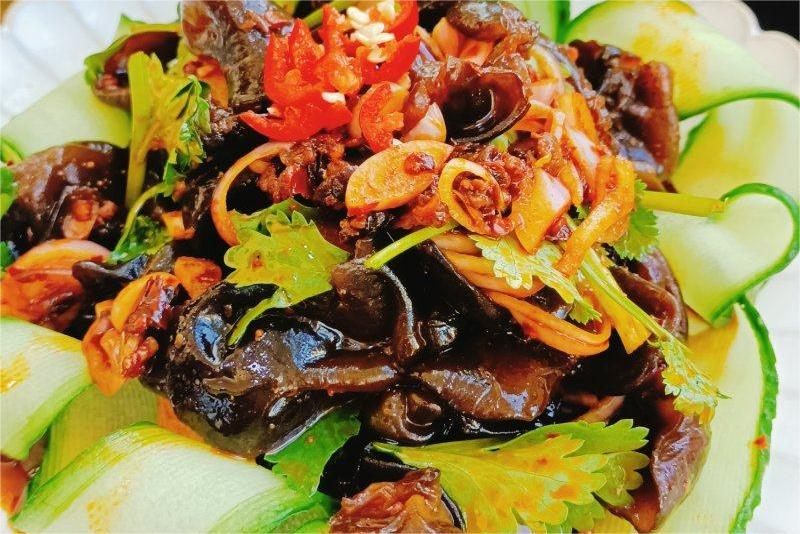

    木耳

 

<table style="border:none;">
    <tr>
        <th colspan="5"style="border:none;width: 850px">
            目录
        </th>
    </tr>
    <tr style="width: 500px; border:none;">
        <td style="border:none">
        食材简介
        </td>
        <td style="border:none">
        美食菜品
        </td>
        <td style="border:none">
        食材营养
        </td>
        <td style="border:none">
        功效禁忌
        </td>
        <td style="border:none">
        音频解析
        </td>
    </tr>
</table>

## 食材简介

---

>木耳，又叫云耳、桑耳，是我国重要的食用菌，有广泛的自然分布和人工栽培。木耳质地柔软，口感细嫩，味道鲜美，风味特殊，而且富含蛋白质、脂肪、糖类及多种维生
素和矿物质，有很高的营养价值，现代营养学家盛赞其为“素中之荤”。木耳的营养价值可与动物性食物相媲美，其极其丰富的铁、维生素K含量。

## 美食菜品

---

    

        
        
凉拌木耳

    

    

         
        
木耳炒莴笋

    

    

        
        
木耳蛤蜊肉炒韭菜

    

    

         
        
鱼香肉丝

    

         
        
老干妈木耳

    

 
 
 
 
 
 
 
 
 
 
 

## 食材营养

---
>木耳的营养价值是非常丰富的，含有大量的碳水化合物、蛋白质、铁、钙、磷、胡萝卜素、维生素等营养物质。

**每百克木耳营养成分含量**

| 营养名称  | 含量      | 营养名称 | 含量     |
|-------|---------|------|--------|
| 蛋白质   | 10.6（克） | 脂肪   | 0.2（克） |
| 碳水化合物 | 65.5（克） | 纤维素  | 7（克）   |

## 功效禁忌

---

>**功效** 
>木耳通常生长在朽木上，是常见的食用菌。颜色为淡褐色，形似人耳。木耳脆嫩可口，味道鲜美，富含大量蛋白质、碳水化合物、铁、钙、磷、胡萝卜素等多种营养成分。具有补血、排毒、预防癌症及预防血栓等功效。 
>1.**补血** 
>木耳可起到补血活血的作用。其中含有丰富的微量元素铁，有助于增强人体造血功能，补血效果比较好。也具有明显的活血作用，可加快人体血液循环，防止血液出现阻滞，有效改善气血不足等问题。 
>2.**排毒** 
> 木耳中含有大量植物碱和活性酶，这些物质对身体当中的纤维组织等异物有催化作用，可促使其尽快排出。木耳中还具有天然胶质，吸附能力较强，可吸附体内的毒素，使其尽快排出体外。 
>3.**预防癌症** 
> 木耳中含有天然多糖，具有抗癌作用，可防止细胞发生恶变。并能清除体内的致癌物质，减少对身体造成的伤害。 
>4.**预防血栓** 
> 木耳抗凝血功能较强，可提高血小板活性，并能促进血液循环，防止血液中出现栓块，有助于预防血栓。

>**适用人群** 
> 心脑血管疾病、结石症患者、缺铁性贫血患者。 
>**禁忌人群** 
> 有出血倾向的人群、慢性腹泻者。 
>**不宜同食** 
> 麦冬、田螺、鹌鹑肉。

## 放松音乐

---

<iframe frameborder="no" border="0" marginwidth="0" marginheight="0" width=330 height=86 src="//music.163.com/outchain/player?type=2&id=1893321422&auto=1&height=66"></iframe>

 
 
 
 
 