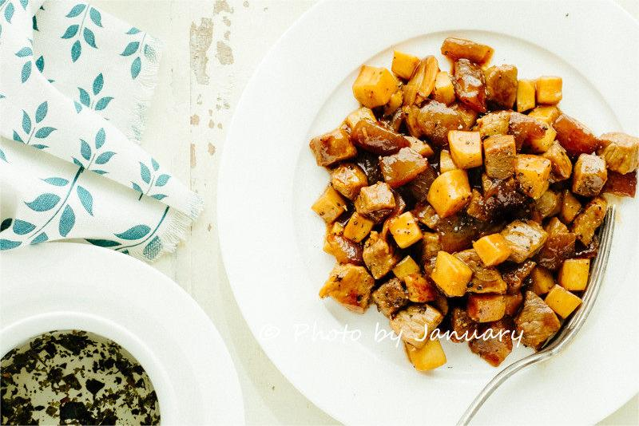
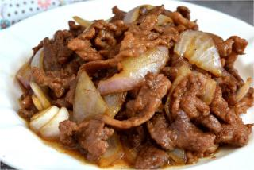
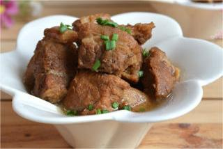
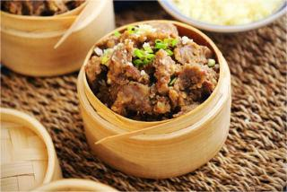
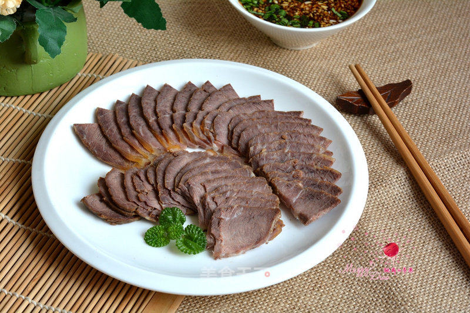

    牛肉粒

 

<table style="border:none;">
    <tr>
        <th colspan="5"style="border:none;width: 850px">
            目录
        </th>
    </tr>
    <tr style="width: 500px; border:none;">
        <td style="border:none">
        食材简介
        </td>
        <td style="border:none">
        美食菜品
        </td>
        <td style="border:none">
        食材营养
        </td>
        <td style="border:none">
        功效禁忌
        </td>
        <td style="border:none">
        音频解析
        </td>
    </tr>
</table>

## 食材简介

---

>牛肉粒是牛肉小方颗粒，色泽褐红，甜中有咸，甘中有辣，后味醇香。牛肉是中国人的第二大肉类食品，仅次于猪肉。牛肉的蛋白质含量高，而脂肪含量低，所以味道鲜美，受人喜爱，享有“肉中骄子”的美称。

## 美食菜品

---

    

        
        
杏鲍菇牛肉粒

    

    

         
        
洋葱炒牛肉

    

    

        
        
炖牛肉

    

    

         
        
粉蒸牛肉

    

         
        
酱牛肉

    

 
 
 
 
 
 
 
 
 
 
 

## 食材营养

---

>牛肉含有丰富的蛋白质和氨基酸，每100克牛肉中含有蛋白质19.9克，烟酸5.6mg，铁3.3mg，锌4.73mg，一般人均可食用，尤其适合生长发育期的孩子。

>牛肉的组成比猪肉更接近人体需要，能够提高机体抗病能力，对生长发育、手术后、病后调养的人在补充失血和修复组织等方面特别适宜。中医认为寒冬食牛肉有暖胃作用，
为寒冬补益佳品。牛肉有补中益气、滋养脾胃、强健筋骨的功效。
> 
>牛肉是指从牛身上得出的肉，为常见的肉品之一。牛的肌肉部分可以切成牛排、牛肉块或牛仔骨，也可以与其他的肉混合做成香肠或血肠。其他可食用的部位还有牛尾、牛肝、牛舌、牛百叶、牛心、牛脑、牛肾等。

## 功效禁忌

---

>**功效** 
>吃牛肉粒的好处和功效是益气血。适合气血不足、面色苍白、四肢无力的人食用，能够很好的增强身体素质。此外，牛肉粒对于疲弱虚位导致的恶心呕吐、食欲不振、消化
不良也具有很好的缓解作用。对于腰膝酸软、腰腿疼痛的人群，适当的食用牛肉粒，具有很好的强壮筋骨的效果。

>**适用人群** 
> 一般人群均可食用。适宜于【生长发育、术后、病后调养】的人、【中气不足、气短体虚、筋骨酸软、贫血、面黄目眩】之人食用。 
> **禁忌人群** 
> 【感染性疾病、肝病、肾病、疮疥湿疹、痘痧、瘙痒、高胆固醇、高脂肪、老年人、儿童、消化力弱】的人不宜多吃。

## 放松音乐

---

<iframe frameborder="no" border="0" marginwidth="0" marginheight="0" width=330 height=86 src="//music.163.com/outchain/player?type=2&id=1893321422&auto=1&height=66"></iframe>

 
 
 
 
 