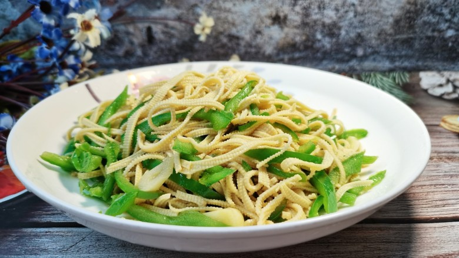
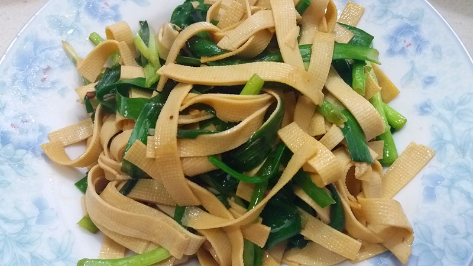
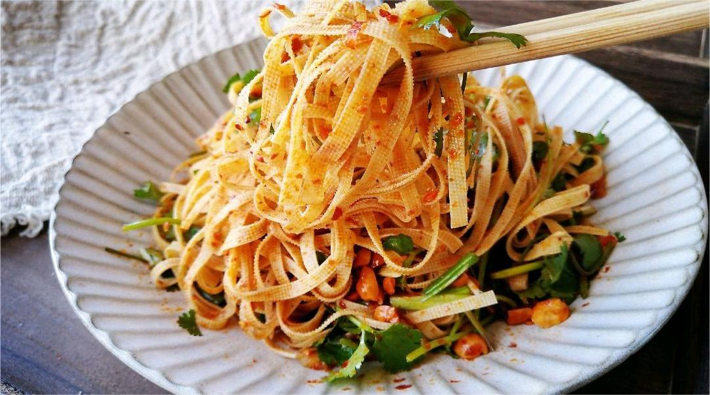

    粉芡

 

<table style="border:none;">
    <tr>
        <th colspan="5"style="border:none;width: 850px">
            目录
        </th>
    </tr>
    <tr style="width: 500px; border:none;">
        <td style="border:none">
        食材简介
        </td>
        <td style="border:none">
        美食菜品
        </td>
        <td style="border:none">
        食材营养
        </td>
        <td style="border:none">
        功效禁忌
        </td>
        <td style="border:none">
        放松音乐
        </td>
    </tr>
</table>

## 食材简介

---
>粉芡，是指淀粉加水和调料搅拌后的勾芡液，主要是做菜时用于勾芡。人的味觉与食物的物理状态和化学组成成分有关，而物理状态如湿度、黏度、温度、嫩度等因素又
会影响食物的味道。

## 美食菜品

---

    

        
        
青椒炒千张

    

    

         
        
凉拌千张丝

    

    

        
        
银鱼千张汤

    

    

         
        
韭菜炒千张

    

         
        
麻辣千张丝

    

 
 
 
 
 
 
 
 
 
 
 

## 食材营养

---

>芡粉是由多个葡萄糖分子缩合而成的多糖聚合物，主要营养成分是碳水化合物、蛋白质，膳食纤维和钙、钠、镁等矿物质。芡粉不溶于水，在和水加热至60℃时，糊化成
胶体溶液，勾芡就是利用芡粉的这种特性，使蔬菜间接受热，保护食物的营养成分并改善口味，可使流失的营养素随著浓稠的汤汁一起被食用。芡粉还含有还原性谷胱甘肽，对维生素C有保护作用。

## 功效禁忌

---
>**适合人群** 
> 一般人皆可食用。肥胖者不宜多食。每餐20克左右。

>**注意事项** 
> 淀粉是人类饮食中最主要的糖类来源，含高淀粉的食物其脂肪和热量的含量并不一定高，只有在过量食用时，才会形成高的脂肪和热量。芡粉，原指用芡实做的粉，勾芡
用，但现在也泛指勾芡用的所有粉。芡粉吸湿性强，还有吸收异味的特点，应注意防潮、防霉、防异味。如果发生霉变或有异味，切勿食用。

## 放松音乐

---

<iframe frameborder="no" border="0" marginwidth="0" marginheight="0" width=330 height=86 src="//music.163.com/outchain/player?type=2&id=1893321422&auto=1&height=66"></iframe>

 
 
 
 
 