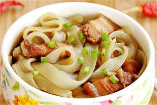
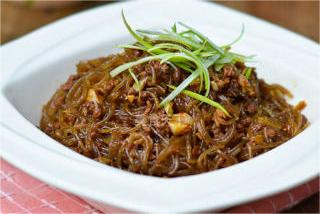
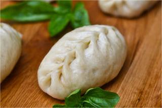
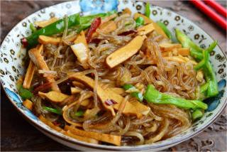
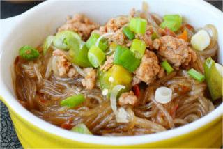

    细粉条

 

<table style="border:none;">
    <tr>
        <th colspan="5"style="border:none;width: 850px">
            目录
        </th>
    </tr>
    <tr style="width: 500px; border:none;">
        <td style="border:none">
        食材简介
        </td>
        <td style="border:none">
        美食菜品
        </td>
        <td style="border:none">
        食材营养
        </td>
        <td style="border:none">
        功效禁忌
        </td>
        <td style="border:none">
        音频解析
        </td>
    </tr>
</table>

## 食材简介

---

>粉条，是以红薯、马铃薯等为原料，经磨浆沉淀加工后，制成的丝条状干燥的特色传统食品。中国各地均有各自独特的生产工艺，成品粉条呈灰白色，黄色或黄褐色，按形状可分为圆粉条、细粉条和宽粉条等。

## 美食菜品

---

    

        
        
猪肉炖粉条

    

    

         
        
肉末粉条

    

    

        
        
韭菜粉条大包

    

    

         
        
香干炒粉条

    

         
        
蚂蚁上树

    

 
 
 
 
 
 
 
 
 
 
 

## 食材营养

---

>1. 粉条里富含碳水化合物、膳食纤维、蛋白质、烟酸和钙、镁、铁、钾、磷、钠等矿物质；
>2. 粉条有良好的附味性，它能吸收各种鲜美汤料的味道，再加上粉条本身的柔润嫩滑，更加爽口宜人。

>**每百克粉条营养成分** 

| 营养名称 | 含量         | 营养名称  | 含量       |
|------|------------|-------|----------|
| 脂肪   | 0.1（克）     | 蛋白质   | 0.5（克）   |
| 热量   | 337.00（大卡） | 碳水化合物 | 84.20（克） |
| 纤维素  | 0.60（克）    | 烟酸    | 0.10（毫克） |

## 功效禁忌

---

>**功效作用** 1. **补充营养** 
>粉条富含碳水化合物、纤维素、蛋白质、烟酸和各种微量元素，能够补充人体所需营养。
>2. **减肥** 
>把粉条当做正餐，可以在保证每天碳水化合物摄入量的同时，降低热量，达到减肥的功效。

>**适用人群** 
> 一般人群均可食用。 
> **禁用人群** 
>因制作过程中会添加明矾（十二水合硫酸铝钾），孕妇慎用！ 
> **注意事项** 
> 人体长期摄入铝残留量超标的粉条，对脑神经有毒害作用，可能会损伤大脑。此外，还会干扰人的意识和记忆功能，导致老年痴呆，引发肝病，贫血，骨质疏松等疾病。

## 放松音乐

---

<iframe frameborder="no" border="0" marginwidth="0" marginheight="0" width=330 height=86 src="//music.163.com/outchain/player?type=2&id=1893321422&auto=1&height=66"></iframe>

 
 
 
 
 