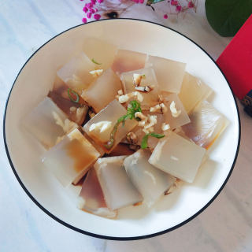
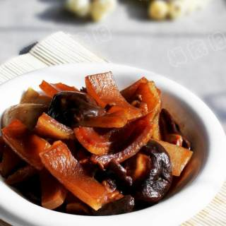
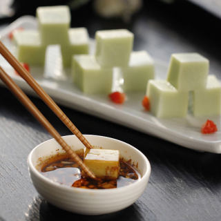
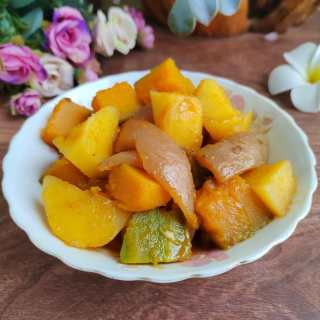
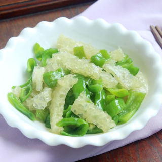

    肉皮冻

 

<table style="border:none;">
    <tr>
        <th colspan="5"style="border:none;width: 850px">
            目录
        </th>
    </tr>
    <tr style="width: 500px; border:none;">
        <td style="border:none">
        食材简介
        </td>
        <td style="border:none">
        美食菜品
        </td>
        <td style="border:none">
        食材营养
        </td>
        <td style="border:none">
        功效禁忌
        </td>
        <td style="border:none">
        音频解析
        </td>
    </tr>
</table>

## 食材简介

---

>皮冻是一种家常菜，以猪皮作为原料，猪皮是一种蛋白质含量很高的肉制品原料，以猪皮为原料加工成的皮花肉、皮冻、火腿等肉制品，不但韧性好，色、香、味、口感俱
佳，而且对人的皮肤、筋腱、骨骼、毛发都有重要的生理保健作用。

## 美食菜品

---

    

        
        
凉拌皮冻

    

    

         
        
红烧肉皮

    

    

        
        
翡翠皮冻

    

    

         
        
肉皮南瓜烧土豆

    

         
        
青椒炒肉皮

    

 
 
 
 
 
 
 
 
 
 
 

## 食材营养

---

>猪皮是一种蛋白质含量很高的肉制品原料。以猪皮为原料加工成的皮花肉、皮冻、火腿等肉制品，不但韧性好，色、香、味、口感俱佳，而且对人的皮肤、筋腱、骨骼、毛发都有重要的生理保健作用。
>猪皮中含有大量的胶原蛋白质，它在烹调过程中可转化成明胶，明胶具有网状空间结构，它能结合许多水，增强细胞生理代谢，有效地改善机体生理功能和皮肤组织细胞的
储水功能，使细胞得到滋润，保持湿润状态，防止皮肤过早褶皱，延缓皮肤的衰老过程。

## 功效禁忌

---

>**适宜人群** 
> 适宜阴虚之人心烦、咽痛、下利者食用；适宜妇女血枯、月经不调者食用；也适宜血友病人出血者食用；
>**禁忌人群** 
> 外感咽痛、寒下利者忌食；患有肝病疾病、动脉硬化、高血压病的患者应少食或不食为好。

## 放松音乐

---

<iframe frameborder="no" border="0" marginwidth="0" marginheight="0" width=330 height=86 src="//music.163.com/outchain/player?type=2&id=1893321422&auto=1&height=66"></iframe>

 
 
 
 
 