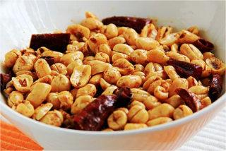
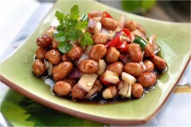
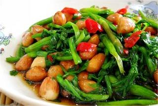
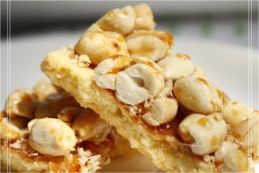
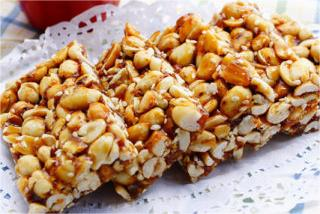

    花生

 

<table style="border:none;">
    <tr>
        <th colspan="5"style="border:none;width: 850px">
            目录
        </th>
    </tr>
    <tr style="width: 500px; border:none;">
        <td style="border:none">
        食材简介
        </td>
        <td style="border:none">
        美食菜品
        </td>
        <td style="border:none">
        食材营养
        </td>
        <td style="border:none">
        功效禁忌
        </td>
        <td style="border:none">
        音频解析
        </td>
    </tr>
</table>

## 食材简介

---

>花生，原名落花生，别名地豆、番豆，豆科落花生属植物。

>花生一年生草本。根部有丰富的根瘤；翼瓣与龙骨瓣分离，翼瓣长圆形或斜卵形，细长；花柱延伸于萼管咽部之外，柱头顶生，小，疏被柔毛。花果期6-8月。花生宜气候
温暖，生长季节较长，雨量适中的沙质土地区；原产于南美洲。在中国，山东生长较佳。现世界各地广泛栽培。落花生为重要油料作物之一，种子含油量约45%，除食用外，亦是制皂和生发油等化妆品的原料；油麸为肥料和饲料；茎、叶为良好绿肥，茎可供造纸。[3]

## 美食菜品

---

    

        
        
酒鬼花生

    

    

         
        
老醋花生

    

    

        
        
糖醋水芹酥花生

    

    

         
        
焦糖花生酥

    

         
        
花生芝麻酥糖

    

 
 
 
 
 
 
 
 
 
 
 

## 食材营养

---

>花生的营养丰富，可以与鸡蛋、牛奶、肉类等一些动物性食物媲美。

>**每百克花生营养成分表** 

| 营养成分  | 含量      | 营养成分 | 含量      | 营养成分 | 含量      |
|-------|---------|------|---------|------|---------|
| 碳水化合物 | 23.8（克） | 蛋白质  | 21.7（克） | 脂肪   | 48（克）   |
| 能量    | 589（千卡） | 膳食纤维 | 6.3（克）  | 胆固醇  | 0.0（毫克） |
| 维生素A  | 10（毫克）  | 胡萝卜素 | 60（毫克）  | 维生素C | 0.0（毫克） |

## 功效禁忌

---
>**功效** 
> 吃花生的好处有抗老化性、凝血止血、滋血通乳、促进发育、增强记忆等。选择花生要将外观呈黄绿色的花生剔除，经过漂洗、水煮，花生所污染的黄曲霉菌毒素基本上
能溶到水里去，从这一点来讲，花生煮着吃的相对来说较为安全，也易于消化吸收。

>**适用人群** 
适宜营养不良，食欲不振，咳嗽之人食用；适宜脚气病患者食用；适宜孕妇食用，可以预防贫血；适宜宝宝食用，能提高宝宝记忆力；适宜妇女产后乳汁缺少者食用。 
>**禁忌人群** 
> 花生含油脂多，消化时需要多耗胆汁，故胆病患者不宜食用；花生能增进血凝，促进血栓形成，故患血黏度高或有血栓的人不宜食用；体寒湿滞及肠滑便泄者不宜服食；
内热上火者不宜食用，因花生性燥，能使口腔炎、舌炎、唇疱疹、鼻出血等更加重，长久不愈；跌打损伤者不宜食用，因花生中有一种凝血因子，可使血淤不散，加重淤肿。

## 放松音乐

---

<iframe frameborder="no" border="0" marginwidth="0" marginheight="0" width=330 height=86 src="//music.163.com/outchain/player?type=2&id=1893321422&auto=1&height=66"></iframe>

 
 
 
 
 