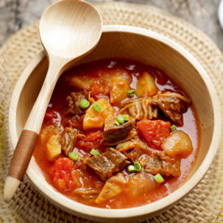

    西红柿

 

<table style="border:none;">
    <tr>
        <th colspan="5"style="border:none;width: 850px">
            目录
        </th>
    </tr>
    <tr style="width: 500px; border:none;">
        <td style="border:none">
        食材简介
        </td>
        <td style="border:none">
        美食菜品
        </td>
        <td style="border:none">
        食材营养
        </td>
        <td style="border:none">
        功效禁忌
        </td>
        <td style="border:none">
        音频解析
        </td>
    </tr>
</table>

## 食材简介

---

>番茄是茄科茄属的一年生草本植物，植株高达2米。茎易倒伏；叶为羽状复叶，基部呈楔形，较偏斜，具有不规则的锯齿；花冠呈辐状，
黄色，裂片为窄长圆形；浆果呈扁球形或近球形，肉质多汁液，为桔黄或鲜红色，表面光滑，花果期夏秋季；种子黄色，覆盖柔毛。

## 美食菜品

---

    

        
        
西红柿炒鸡蛋

    

    

         
        
番茄柚子汁

    

    

        
        
番茄炖牛腩

    

    

         
        
秋葵烤蛋

    

         
        
番茄鸡蛋疙瘩汤

    

 
 
 
 
 
 
 
 
 
 
 

## 食材营养

---
>**每百克西红柿营养成分表**

| 营养成分  | 含量     | 营养成分 | 含量     | 营养成分 | 含量     |
|-------|--------|------|--------|------|--------|
| 能量    | 85（千焦） | 蛋白质  | 0.9（克） | 脂肪   | 0.2（克） |
| 碳水化合物 | 4.0（克） | 维生素A | 92（微克） | 维生素C | 19（微克） |

## 功效禁忌

---

>**功效** 
>1. **可降低患前列腺癌的风险** 
番茄红素是西红柿中的一种抗氧化剂，与降低患前列腺癌的风险有关。番茄红素作用于各种有助于防止癌细胞发展和扩散的生化途径。番茄加工食品（如番茄酱或罐装番茄）中的番茄红素含量较高，因为加工涉及去除水分并留下更浓缩的番茄产品。

2. **支持心脏健康** 
西红柿中的番茄红素与其他抗氧化维生素（如维生素 A、E 和 C）协同作用，为心脏健康提供复合益处。一些研究表明西红柿中的番茄红素与氧化的低密度脂蛋白和动脉斑块减少之间存在关系。西红柿还含有钾，众所周知，钾可以降低血压。

3. **保护视力** 
西红柿是维生素 A的极好来源，更具体地说，是叶黄素和玉米黄质。这两种形式的维生素 A 在视网膜中积累并预防与年龄相关的黄斑变性。食用西红柿作为包含一些脂肪的菜肴的一部分（例如在沙拉中加入橄榄油）可以提高脂溶性维生素的吸收，这对于良好的视力至关重要。

4. **防止阳光伤害** 
西红柿中的植物营养素可防止 UVB 损伤的某些影响。尽管仅靠西红柿不足以预防皮肤癌，但在您的膳食计划中加入西红柿可能会提高您的身体对某些类型太阳光线危害的抵抗力。

5. **可降低糖尿病并发症的风险** 
西红柿与啮齿动物的抗高血糖作用有关，但在人类中却没有。尽管如此，西红柿仍然对糖尿病患者有益。西红柿已被证明可以减少由糖尿病引起的氧化应激。它们还可以减少炎症、加速动脉粥样硬化和组织损伤，这些都是该疾病的常见并发症。 

>**适宜人群** 
> 西红柿一般人群均可食用。患有肝炎、发热口干、暑热烦渴、高血压病、肾脏病、心脏病、眼底出血、癌症、维生素C以及缺乏症、烟酸缺乏症（糙皮病）、糖尿病、习惯性牙龈出血等病症者适宜食用；胆固醇代谢不良者经常食用也有好处。 
>**禁忌人群** 
> 急性肠炎、菌痢及溃疡活动期病人不宜食用，以免影响身体健康。

## 放松音乐

---

<iframe frameborder="no" border="0" marginwidth="0" marginheight="0" width=330 height=86 src="//music.163.com/outchain/player?type=2&id=1893321422&auto=1&height=66"></iframe>

 
 
 
 
 