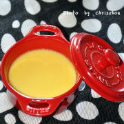
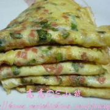
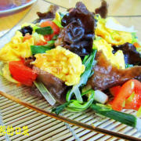
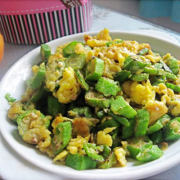
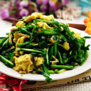

    鸡蛋

 

<table style="border:none;">
    <tr>
        <th colspan="5"style="border:none;width: 850px">
            目录
        </th>
    </tr>
    <tr style="width: 500px; border:none;">
        <td style="border:none">
        食材简介
        </td>
        <td style="border:none">
        美食菜品
        </td>
        <td style="border:none">
        食材营养
        </td>
        <td style="border:none">
        功效禁忌
        </td>
        <td style="border:none">
        音频解析
        </td>
    </tr>
</table>

## 食材简介

---
>鸡蛋，又名鸡卵、鸡子，是母鸡所产的卵。鸡蛋里含量最高的是蛋白质，蛋白质受热容易变性。 鸡蛋含蛋白质多，会加重胃肠负担。

## 美食菜品

---

    

        
        
鸡蛋布丁

    

    

         
        
鸡蛋饼

    

    

        
        
木耳炒鸡蛋

    

    

         
        
秋葵炒鸡蛋

    

         
        
韭菜炒鸡蛋

    

 
 
 
 
 
 
 
 
 
 
 
 
 

## 食材营养

---

>**每百克鸡蛋营养成分表**

| 营养成分  | 含量      | 营养成分 | 含量      |
|-------|---------|------|---------|
| 能量    | 144（千卡） | 蛋白质  | 13.3（克） |
| 脂肪    | 8.8（克）  | 胆固醇  | 585（微克） |
| 碳水化合物 | 2.8（克）  |||

## 功效禁忌

---

>**适宜人群** 
>1. 适宜体质虚弱，营养不良，贫血及妇女产后病后调养； 适宜婴幼儿发育期补养；

>2. 患高热、腹泻、肝炎、肾炎、胆囊炎、胆石症之人忌食；

>3. 老年高血压、高血脂、冠心病人，宜少量食用鸡蛋，一般每日不超过1只，不宜多食，这样限量食用，既可补充优质蛋白质，又不影响血脂水平。
>**禁忌人群** 
>1. **肾脏病患者肾炎患者** 
肾功能和新陈代谢减退，尿量减少，体内代谢产物不能全部由肾脏排出体外，若食用鸡蛋过多，可使体内尿素增多，导致肾炎病情加重， 甚至出现尿毒症。高血压晚期
患者食用鸡蛋会引起肾中动脉硬化，系统性红斑狼疮伴肾损害和各种慢性肾脏疾病导致慢性肾功能衰竭者，应慎吃鸡蛋或遵医嘱。

>2. **高热患者** 
鸡蛋中的蛋白质为完全蛋白质，进入机体可分解产生较多的热量，这称之为食物的特殊动力效应。这种特殊动力效应以蛋白质效应最大，增加热量的效应可达30%左右。故发热患者吃鸡蛋后体内产热增加，散热减少，如同火上浇油，于退烧不利。
此外，发热患者消化腺分泌减少，各种消化酶的活力下降，应吃清淡饮食，少吃含高蛋白质的食品。

>3. **肝炎患者不宜吃蛋黄** 
若肝炎患者较多食用蛋黄会加重肝脏的负担，不利于康复。因蛋黄中含有脂肪酸和胆固醇，而脂肪酸和胆固醇均需在肝脏代谢。肝脏的负担过重，不利于肝炎的恢复。

>4. **初产妇** 
坐月子期间常以鸡蛋为主食，但吃鸡蛋并非越多越好。分娩后数小时内最好不要吃鸡蛋。因为分娩过程体力消耗大，出汗多，体内体液不足，消化能力 随之下降，若产后立即吃鸡蛋，就难以消化吸收，增加胃肠负担，这时应以吃半流质或流质为宜。有些产妇为了加强营养，一天吃很
多个鸡蛋，其实这对身体并无好 处，产妇每天吃3个鸡蛋就够了。

>5. **老年人** 
鸡蛋中含有较高的胆固醇，一般认为胆固醇可导致高脂血症、冠心病、动脉粥样硬化等老年性疾病，这就产生了老年人不宜吃鸡蛋的说法。但是，近年来一些科学家通过试验证明，鸡蛋中虽含有胆固醇，但卵磷脂的含量同样丰富，卵磷脂对心血管疾病有治疗作用，卵磷脂被吸收入血可使血液中的胆固醇和脂肪颗粒变小并保持悬浮状态，从而减少了胆固醇和脂肪在血管壁上的沉积。所以，血清胆固醇浓度正常的老年人每天吃一个鸡蛋不会引起动脉粥样硬化症，鸡蛋的其它营养成分还能带来许多好处。

6. **蛋白质过敏者** 
有些人吃了鸡蛋后会胃痛，或出现斑疹，这是对鸡蛋过敏引起的。鸡蛋的蛋白质具有抗原性，与胃肠黏膜表面带有抗体的致敏肥大细胞作用，即可引起过敏反应。肥大细胞颗粒释放组织胺等化学物质，使胃肠粘膜充血、水肿、胃肠痉挛，引起胃痛或腹痛、腹泻、斑疹等过敏症状。因此，不吃鸡蛋或含鸡蛋成分的食物是最有效的防治方法。

>**注意事项** 
> 1.**鸡蛋不宜与白糖同煮** 
糖水荷包蛋被人们视为一种营养价值很高的食品。但鸡蛋和白糖同煮，会使蛋白质中的氨基酸形成果糖基赖氨酸的结合物。这种物质，不但不容易被人体消化吸收，而且还会对人体产生不良影响。如在鸡蛋煮熟后，再加点白糖调味，还是可以的。

>2. **鸡蛋不宜与豆乳同食** 
早上喝豆乳的时候吃个鸡蛋，或是把鸡蛋打在豆乳里煮是很多人的饮食习惯。豆乳性味甘平，有大量营养成份，自力饮用有很强的营养用处。但此中有一种非凡物质叫胰蛋白酶，与蛋清中的卵松蛋白相结合，会造成营养成份丧失，减少二者的营养价值。

>3. **鸡蛋不宜与兔肉同食** 
鸡蛋还有一个饮食禁忌，就是不能与兔肉同吃。《本草纲目》中说：“鸡蛋同兔肉食成泄痢。”兔肉性味甘寒酸冷，鸡蛋甘平微寒，二者都含有一些生物活性物质，共食会发生反应，刺激肠胃道，引起腹泻

>4. **鸡蛋不宜与柿子同食** 
会导致急性肠胃炎还有肺结石。一般而言，这两种食物同时吃会导致以上吐、下泻、腹痛为主的急性胃肠炎症状。

>5. **鸡蛋与消炎药不宜同食** 
鸡蛋富含蛋白质，炎症发作时要特别注意蛋白质的摄入。所以当炎症发作时，切记不要在吃鸡蛋后吃药。特别是消化道疾病，有腹泻症状的，更加不能吃鸡蛋。因为鸡蛋含蛋白质多，会加重胃肠负担，相对对药效有影响，特别是脂肪泻。如果是其它炎症，如呼吸系统、泌尿系统等，从西医角度来说是没有多大影响的。

>6. **鸡蛋与茶不宜同食** 
有些人吃完肉食、鸡蛋、海味等高蛋白质食物后，习惯于立即饮茶，以助“去味”、“消化”。其实，这种做法是不科学的。因为茶叶中含有大量鞣酸，鞣酸与蛋白质合成具有收敛性的鞣酸蛋白质，使肠蠕动减慢，从而延长粪便在肠道内滞留的时间，不但易造成便秘，而且还增加有毒物质和致癌物质被人体吸收的可能性，危害人体健康。

>7. **不宜食生鸡蛋** 
鸡蛋蛋白含有抗生物素蛋白，会影响食物中生物素的吸收，使身体出现食欲不振、全身无力、肌肉疼痛、皮肤发炎、脱眉等症状。鸡蛋中含有抗胰蛋白酶，它们影响人体对鸡蛋蛋白质的消化和吸收。未熟的鸡蛋中这两种物质没有被分解，因此影响蛋白质的消化、吸收。 鸡蛋在形成过程中会带菌，未熟的鸡蛋不能将细菌杀死，容易引起腹泻。因此鸡蛋要经高温后再吃，不要吃未熟的鸡蛋。

## 放松音乐

---

<iframe frameborder="no" border="0" marginwidth="0" marginheight="0" width=330 height=86 src="//music.163.com/outchain/player?type=2&id=1893321422&auto=1&height=66"></iframe>

 
 
 
 
 