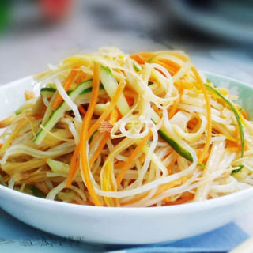
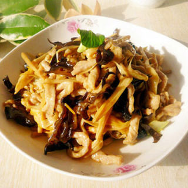
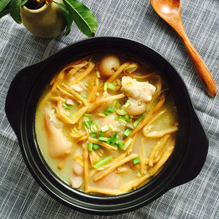
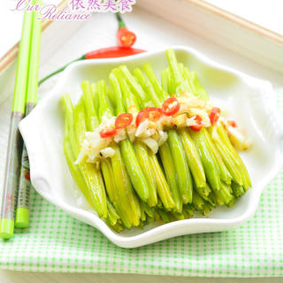
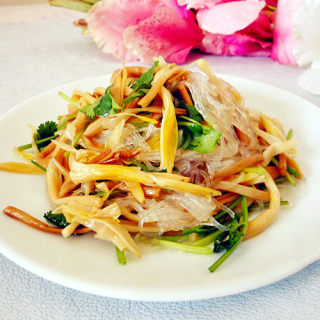

    黄花菜

 

<table style="border:none;">
    <tr>
        <th colspan="5"style="border:none;width: 850px">
            目录
        </th>
    </tr>
    <tr style="width: 500px; border:none;">
        <td style="border:none">
        食材简介
        </td>
        <td style="border:none">
        美食菜品
        </td>
        <td style="border:none">
        食材营养
        </td>
        <td style="border:none">
        功效禁忌
        </td>
        <td style="border:none">
        音频解析
        </td>
    </tr>
</table>

## 食材简介

---

>黄花菜，阿福花科萱草属被子植物，植株一般较高大，根的中下部常有纺锤状膨大；叶绿色；花葶基部呈三棱形，上部呈圆柱形；
苞片为披针形；花梗较短，花被淡黄色，花蕾顶端有时黑紫色；蒴果呈黑色钝三棱状椭圆形；种子黑色，有棱；花果期5～9月。黄花菜因其花蕾色泽金黄而得名。

## 美食菜品

---

    

        
        
黄花菜拌粉丝

    

    

         
        
黄花菜木耳炒肉

    

    

        
        
黄花菜猪脚汤

    

    

         
        
凉拌黄花菜

    

         
        
木耳粉丝黄花菜

    

 
 
 
 
 
 
 
 
 
 
 
 
 
 
 

## 食材营养

---

>**每一百克黄花菜营养成分表** 

| 营养成分 | 含量      | 营养成分  | 含量      |
|------|---------|-------|---------|
| 能量   | 214（千卡） | 蛋白质   | 19.4（克） |
| 脂肪   | 1.4（克）  | 碳水化合物 | 34.9（克） |
| 膳食纤维 | 7.7（克）  |||

## 功效禁忌

---

>**功效** 
> 黄花菜性平，能健脾，提高脾胃的运化功能，改善脘痞食少、口淡不渴、呕吐便溏等症。黄花菜的花可食用，具有清热利湿的作用，能缓解小便赤涩、痔疮便血、湿热黄疸等症。黄花菜还有通乳的作用，适合哺乳期女性食用。另外，黄花菜中含有卵磷脂，是人体大脑细胞的重要组成部分，适量食用可增强记忆力，延缓脑细胞衰老。

>**适宜人群** 
> 一般人群均适宜。 
>**禁忌人群** 
> 皮肤瘙痒症者、哮喘病者。

## 放松音乐

---

<iframe frameborder="no" border="0" marginwidth="0" marginheight="0" width=330 height=86 src="//music.163.com/outchain/player?type=2&id=1893321422&auto=1&height=66"></iframe>

 
 
 
 
 